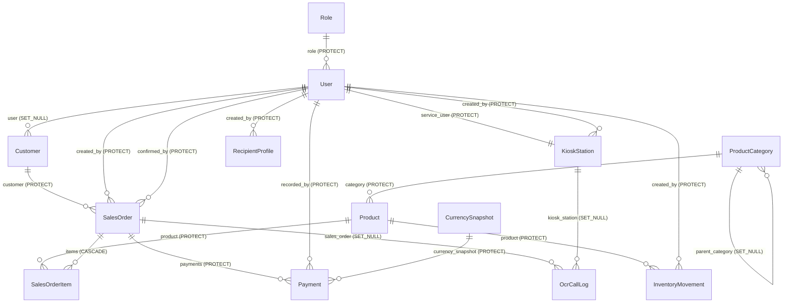
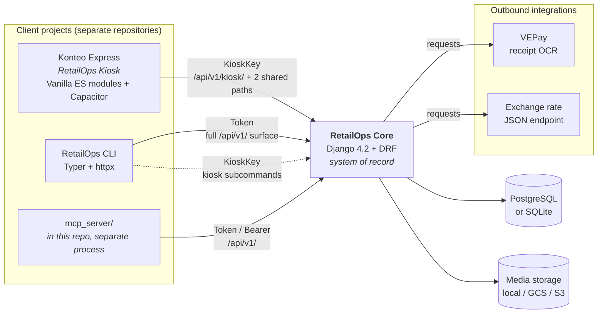
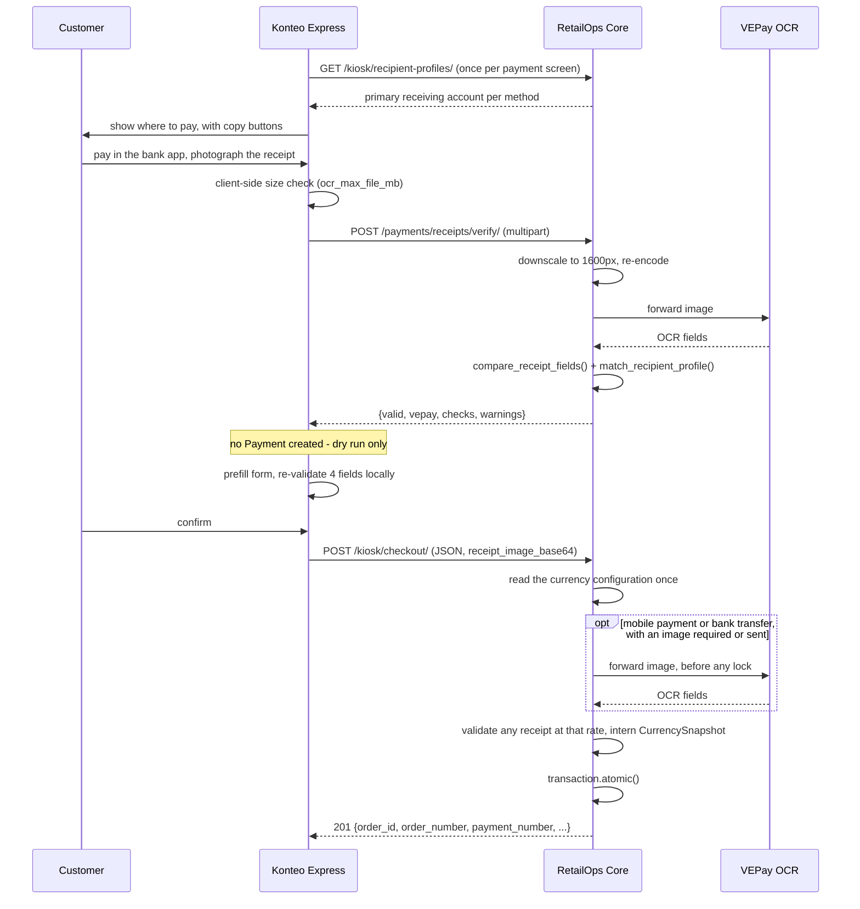

# RetailOps Architecture

System architecture of the RetailOps backend and a map of how the three RetailOps
projects interact and depend on one another.

This document is descriptive. It records how the system is built today, not how it
should change.

> **Verified 2026-09-28** against RetailOps Core `bd394d5`, Konteo Express `6242108`,
> and RetailOps CLI `23e89bc`. Every claim, count, and `file:line` reference holds at
> those commits; section 17 records how each was checked, so the next refresh can
> repeat it.

**Part I** covers RetailOps Core - the Django/DRF backend in this repository.
**Part II** covers the relationship between Core, RetailOps Kiosk (Konteo Express),
and RetailOps CLI.

Related reading: `API_GUIDE.md` (endpoint reference), `KIOSK_INTEGRATION.md` (kiosk
contract), `MCP_GUIDE.md` and `AGENT_INTEGRATION.md` (agent integration),
`DATABASE_CONFIGURATION.md` and `MEDIA_STORAGE_CONFIGURATION.md` (deployment
profiles), and `MULTI_TENANCY.md` (a feasibility study built on this document).

---

# Part I - RetailOps Core

## 1. Stack and dependencies

RetailOps Core is a **Django 4.2 + Django REST Framework monolith**. It serves three
surfaces from one process: a server-rendered back-office, a versioned JSON API, and
an isolated kiosk API namespace. A fourth surface, the MCP server, runs out of
process and talks to the JSON API like any other client.

Dependencies are declared in a single `requirements.txt`. There is no
`pyproject.toml` and no lockfile.

| Package | Constraint | Role in this codebase |
|---|---|---|
| `Django` | `>=4.2,<5.0` | Web framework. The LTS pin also caps the supported Python at 3.12. |
| `djangorestframework` | `>=3.15,<3.16` | Everything under `/api/v1/`: viewsets, serializers, throttling, exception handling. |
| `django-filter` | `>=24.0` | `DjangoFilterBackend` and every `FilterSet` in `api/filters.py`. |
| `dj-database-url` | `>=2.2,<3.0` | Parses `DATABASE_URL`. Imported defensively inside a `try/except ImportError`. |
| `django-storages[google,s3]` | `>=1.14,<2.0` | GCS and S3 backends, wrapped by `retailops/storage.py`. |
| `drf-spectacular` | `>=0.27` | OpenAPI 3 schema plus Swagger UI and ReDoc. |
| `gunicorn` | `>=22.0,<24.0` | WSGI server. No config file or Procfile ships in this repo. |
| `Pillow` | `>=10.0,<13.0` | `ImageField` validation, and the receipt downscale/re-encode step in `api/views/payment.py`. |
| `requests` | `>=2.32,<3.0` | Synchronous HTTP for the two outbound integrations: VEPay OCR and the BCV exchange rate. |
| `responses` | `>=0.25,<0.26` | Mocks `requests` in the test suite. |
| `psycopg[binary]` | `>=3.2,<4.0` | PostgreSQL driver. |
| `mcp` | `>=1.27.0,<2` | FastMCP server under `mcp_server/`. Capped below 2 because the server is written against the v1 API. |
| `httpx` | `>=0.28.1` | Async client the MCP layer uses to call this same REST API. |
| `python-dotenv` | `>=1.2.2` | Loads `.env` for the MCP server only. Django itself does not auto-load `.env`. |

Three characteristics of this dependency set are worth stating plainly, because they
shape the rest of the architecture:

- **No cache backend is configured.** `CACHES` is absent from `retailops/settings.py`,
  so DRF throttling falls back to Django's default `LocMemCache`. That cache is
  per-process, so under gunicorn with more than one worker the effective rate limits
  multiply by the worker count. Throttling is the control protecting `/auth/token/`
  and the kiosk endpoints (section 6), which makes this worth knowing before scaling
  out.
- **No task queue.** There is no Celery, RQ, or Redis. Scheduled work runs as
  management commands intended for cron: `update_bcv_rate` and `purge_receipts`.
- **`responses` is a test-only library shipped in the production requirements file.**

## 2. Module map

```
retailops/
├── retailops/              Django project package
│   ├── settings.py         Single-file, environment-driven settings
│   ├── urls.py             Root URLconf
│   ├── storage.py          RoutedGoogleCloudStorage / RoutedS3Storage
│   ├── email_backend.py    DecodedConsoleEmailBackend (development default)
│   ├── test_runner.py      MediaIsolatedTestRunner
│   ├── wsgi.py  asgi.py
│   └── tests/              Settings-as-code tests
├── core/                   Domain app: all models + back-office HTML
│   ├── models.py           15 models - the single domain module
│   ├── exceptions.py       DomainError and the order/stock errors it roots
│   ├── views.py            Function-based HTML views
│   ├── middleware.py       KioskCORSMiddleware, RegionalMiddleware
│   ├── context_processors.py  system_settings on every template
│   ├── decorators.py       @role_required
│   ├── services/           bcv.py, vepay.py, receipt_matching.py, currency.py,
│   │                       inventory.py, customers.py
│   ├── management/         site_initialization.py (shared by init commands)
│   │   └── commands/       init, bootstrap_local, seed, provision_kiosk,
│   │                       purge_receipts, update_bcv_rate, initialize_site
│   ├── templates/core/     Back-office templates
│   ├── templatetags/       regional.py
│   └── tests/
├── api/                    REST layer - defines no models of its own
│   ├── urls.py             DefaultRouter + explicit paths, app_name='api'
│   ├── views/              One module per resource, plus auth, dashboard,
│   │                       settings, and mcp_skill
│   ├── serializers/        One module per resource, plus the shared currency.py
│   ├── kiosk/              Self-contained kiosk sub-package
│   ├── permissions.py      role_permission() factory
│   ├── filters.py  pagination.py  throttling.py  exceptions.py
│   └── tests/
├── mcp_server/             MCP server - an out-of-process API client
│   ├── server.py  client.py  config.py  errors.py  runtime_auth.py
│   ├── tools/  resources/  prompts/
│   └── tests/
├── locale/es/LC_MESSAGES/  Spanish translations
├── scripts/                Setup and provisioning helpers
└── .github/workflows/ci.yml
```

`INSTALLED_APPS` contains only **two first-party apps**, `core` and `api`, alongside
`rest_framework`, `rest_framework.authtoken`, `django_filters`, and `drf_spectacular`
(`retailops/settings.py:94`).

| Module | Responsibility |
|---|---|
| `core` | Domain model, back-office UI, Django admin, business services, management commands, i18n. |
| `api` | The DRF layer. Serializers, viewsets, permissions, throttles, the error envelope, OpenAPI schema. |
| `api.kiosk` | Isolated namespace for unattended self-checkout terminals. Own authentication, permissions, throttles, serializers, and views. |
| `mcp_server` | Agent-facing MCP wrapper over `/api/v1/`. Deliberately **not** in `INSTALLED_APPS`. |
| `retailops` | Project configuration, storage routing, custom test runner. |

The `mcp_server` placement is a real architectural decision, not an accident. It is a
separate process that authenticates against the REST API over HTTP, which means the
API stays the single authority on roles and permissions. An agent cannot reach the
ORM directly.

## 3. Layer model

A request traverses these layers in order:

```
URLconf  ->  Middleware  ->  Authentication  ->  Permission  ->  Throttle
         ->  ViewSet/View  ->  Serializer  ->  Service  ->  Model  ->  Database
```

### URL routing

`retailops/urls.py` mounts three trees: `admin/`, `api/v1/` (namespace `api`), and
`''` for the back-office. `api/urls.py` combines a `DefaultRouter` covering nine
resources with twelve explicit paths, and includes `api.kiosk.urls` under `kiosk/`
with its own `app_name`.

### Middleware

`retailops/settings.py:109` places `core.middleware.KioskCORSMiddleware` second in
the stack, ahead of `SessionMiddleware`, and `core.middleware.RegionalMiddleware`
immediately after `AuthenticationMiddleware`.

`KioskCORSMiddleware` is a hand-rolled CORS implementation - `django-cors-headers`
is not a dependency. It applies only to paths beginning `/api/v1/`, reads its
allowlist from the `KIOSK_CORS_ORIGINS` environment variable, and in `DEBUG` adds any
`localhost`, `127.0.0.1`, or `::1` origin automatically. Its own docstring recommends
terminating CORS at nginx or Caddy in production.

`RegionalMiddleware` activates the authenticated user's `timezone` and `language`,
then deactivates the timezone after the response so state cannot bleed between
requests.

### Domain models

All 15 models live in `core/models.py`. Some behaviour lives on the models rather
than in services, where it enforces an invariant that must hold for every writer:

- `SequenceCounter.next_value()` uses `SELECT FOR UPDATE` to generate order and
  payment numbers without races.
- `SalesOrder.confirm(user)` (`core/models.py:395`) is the only supported
  Pending -> Confirmed transition. It rejects the wrong status and an empty order,
  then deducts stock and flips the status in one transaction with the product rows
  locked, so an order can never reach Confirmed while leaving a product negative.
  The REST action, its bulk sibling, and the back-office view all delegate to it.
- `SalesOrderItem.save()` recomputes `line_total`, and a `UniqueConstraint`
  (`salesorderitem_unique_product_per_order`) keeps a product on one line per order.
- `Customer.save()` stores `national_id` normalised, so the column's `unique=True`
  means normalised uniqueness: `V-12.345.678` and `V12345678` are one person.
- `RecipientProfile.save()` and `.delete()` maintain the "sole profile is primary"
  rule.
- `SystemSettings.save()` pins `pk=1`, making the model a singleton. It also stamps a
  rate change that arrives without a new `secondary_rate_updated_at` as `manual` at
  the time of the save, so a hand-typed rate never inherits the timestamp of the last
  automatic fetch.
- `SystemSettings.clean()` refuses to change `currency_code` once any order or
  payment exists (section 4).
- `Payment.save()` records the live currency configuration on a new payment, unless
  the caller has already assigned one.
- `CurrencySnapshot.save()` and `.delete()` refuse to touch an existing row.

The rules that can fail raise subclasses of `DomainError` from `core/exceptions.py` -
`OrderStateError`, `EmptyOrderError`, `InsufficientStockError` - and each surface
translates them into its own error format.

### Services

`core/services/` holds the logic that is neither persistence nor HTTP:

- **`vepay.py`** - `VEPayClient`, a `requests` client wrapped with
  `asyncio.to_thread`, calling the external OCR provider. `ocr_timeout_seconds`
  budgets the whole call, retry included: a retryable failure (a 5xx, a timeout, a
  network error) is retried once, after a 1-second backoff, only if the budget still
  leaves room for a real attempt. It normalises both the legacy single-receipt
  response and the newer `{"receipts": [...]}` envelope. The OCR JSON field paths are
  module constants (`PAYMENT_REFERENCE_PATH`, `RECIPIENT_PHONE_PATH`, and so on).
- **`receipt_matching.py`** - pure normalisation and comparison, with no database
  access at all. `compare_receipt_fields()` and `match_recipient_profile()` accept an
  iterable of profile-like objects specifically so they unit-test without the ORM.
  Contains the Venezuelan bank aliases, the account-prefix to bank mapping
  (`'0102' -> 'BDV'`), and phone normalisation that strips the `58` country code and
  the trunk `0`. A receipt paid in the secondary currency is converted at the rate
  of whatever currency context the caller passes in, never a settings read of its
  own, which is what lets kiosk checkout validate with exactly the rate it records.
- **`bcv.py`** - fetches the secondary exchange rate from a configurable JSON endpoint
  (default `https://ve.dolarapi.com/v1/dolares/oficial`), extracting the value by
  dotted path and raising `BCVRateError` with a `code` and `message`. A successful
  fetch saves the rate with `secondary_rate_source='fetched'`.
- **`currency.py`** - the logic of the currency model (section 4). `CurrencyContext`
  is a frozen, normalised value of the currency configuration whose attribute names
  mirror `SystemSettings`, so conversion code accepts a settings row, a context, or a
  stored `CurrencySnapshot` interchangeably. `current_context()` reads the live
  configuration without ever inserting the settings row. `secondary_amount()`
  converts a primary amount, rounding half-up to the secondary decimals under the
  versioned rule `half_up_v1`. `order_amounts()` derives an order's figures in both
  currencies, and `attach_order_amounts()` does so for a whole page from one settings
  read. The module imports nothing from `core.models` at load time, because
  `core.models` imports it.
- **`inventory.py`** - the stock rule every surface shares. `available_stock()`,
  `assert_stock_available()`, `lock_products()` (which takes `SELECT FOR UPDATE` in
  ascending primary-key order, so two confirmations cannot deadlock), and
  `deduct_stock_for_order()`, which `SalesOrder.confirm()` calls. The kiosk's own
  checker defers to it, so a checkout and a back-office confirmation cannot disagree.
- **`customers.py`** - national-ID resolution for every surface that registers or
  finds a customer: the API, both back-office forms, quick-create, and kiosk
  identify/register. It matches through any punctuation of the same ID and still
  reaches rows written before normalisation.

### Serializers

`api/serializers/` splits read from write where the shapes genuinely differ -
`SalesOrderReadSerializer` against `SalesOrderWriteSerializer`, `UserReadSerializer`
against `UserWriteSerializer` - and uses a single serializer where they do not, as
with `Payment`.

Cross-field rules live in `validate()`. `api/serializers/payment.py:189` collects
every missing field before raising, so a client sees all problems in one response
rather than discovering them one round-trip at a time:

```python
if payment_method in REFERENCE_REQUIRED_PAYMENT_METHODS and not reference_number:
    errors['reference_number'] = 'A reference number is required for bank transfer, card, and check payments.'
```

`SalesOrderWriteSerializer` enforces the order rules for the API and MCP alike. It
names `unit_price`, `line_total`, and `tax_rate` as server-derived
(`api/serializers/order.py:135`) and rejects an item carrying any of them with a 400
rather than dropping it silently, so line prices only ever come from the catalogue.
`validate_items()` (`:137`) rejects a product on more than one line, and
`discount_amount` and `tax_amount` are floored at zero, with the total clamped at
zero.

`api/serializers/currency.py` builds the `currency` and secondary-amount blocks that
the payment, order, and kiosk endpoints share (section 12), rendering money as
strings as DRF does for every `DecimalField` - a bolívar amount can carry more
significant digits than a float holds exactly. `live_currency()` caches the live
context in the root serializer's context, so a page of 25 orders reads the settings
once rather than 25 times.

### Views

REST viewsets in `api/views/` that restrict their operations compose `GenericViewSet`
with **explicit mixins**, so the absent operations are visible in the class
definition: inventory, orders, payments, products, and users. `PaymentViewSet`
(`api/views/payment.py:62`) declares only `CreateModelMixin`, `RetrieveModelMixin`,
and `ListModelMixin` - payments are immutable financial records, and the missing
update and destroy mixins are how that is enforced. Categories, customers, and
recipient profiles are full `ModelViewSet`s, and roles a `ReadOnlyModelViewSet`.
Non-resource endpoints - auth, dashboard, settings, the MCP skill descriptor - are
plain `APIView`s.

Back-office HTML views in `core/views.py` are function-based: 45 views, of which 28
are gated with `@role_required(...)` from `core/decorators.py`, 15 with
`@login_required` alone, and 2 are public (`login_view` and `set_language`). Views
that list orders price the page through `attach_order_amounts()` and render it with
the `order_money` and `money` filters in `core/templatetags/regional.py`.

### Permissions

`api/permissions.py` is a factory that builds and names permission classes
dynamically:

```python
IsAdminRole      = role_permission('Admin')
IsManagerOrAdmin = role_permission('Manager', 'Admin')
IsStaffOrAbove   = role_permission('Staff', 'Manager', 'Admin')
```

The generated class checks that the user is authenticated, that `role` is not null,
and that `role.name` is in the allowed set. `RolePermission.__name__` is reassigned so
debugging output and the browsable API show a readable name.

One interaction here has bitten this codebase before and is worth carrying forward:
**overriding `get_permissions()` replaces any `permission_classes` set on an `@action`
decorator.** `OrderViewSet.bulk_transition` declared `IsManagerOrAdmin` on the action
but ran with Staff access because the viewset's `get_permissions()` did not special-case
it. `api/views/order.py:165` now dispatches on `self.action` explicitly, and
`api/tests/test_parity_fixes.py:60` pins single-versus-bulk role parity so the gap
cannot silently reopen.

### Signals and background work

**There are no signals.** No `post_save`, no `pre_save`, no `@receiver` anywhere in
the codebase. Side effects are written explicitly in views and serializers, which
makes the write path readable top to bottom.

There is likewise no task queue. Deferred work is a management command on a cron
schedule: `update_bcv_rate` refreshes the secondary exchange rate, and
`purge_receipts` deletes receipt images past the retention window configured in
`SystemSettings.delete_receipt_image_after_days`.

### Cross-cutting concerns

- **`api/exceptions.py`** - `custom_exception_handler` normalises every API error to
  `{error, code, details?}`, converts Django's `Http404` and `PermissionDenied` into
  their DRF equivalents so they never reach Django's HTML error pages, and logs then
  returns a generic 500 for anything unhandled. This envelope is a cross-project
  contract; see section 12.
- **`api/pagination.py`** - `CappedPageNumberPagination` honours a `page_size` query
  parameter with `max_page_size = 100` and a default of 25.
- **`api/throttling.py`** - six scoped throttle classes, plus four per-station kiosk
  throttles in `api/kiosk/throttling.py`. `OcrVerifyRateThrottle` overrides
  `get_cache_key()` to key on the kiosk station first, then the user, then the IP,
  so one busy terminal cannot consume another station's allowance.

## 4. Domain model



`SequenceCounter` and `SystemSettings` stand outside the graph: the first is a
numbering utility keyed by prefix, the second a `pk=1` singleton. `CurrencySnapshot`
copies its values out of `SystemSettings` rather than referencing it, and has no
reverse accessor on `Payment` (`related_name='+'`).

### By domain

**Identity and access.** `Role` carries the choices `Admin`, `Manager`, `Staff`, and
`Kiosk`. `User` extends `AbstractBaseUser` and `PermissionsMixin` with
`USERNAME_FIELD = 'email'`, no `username` column, a custom `UserManager`, and the
`timezone` and `language` fields `RegionalMiddleware` reads. `AUTH_USER_MODEL` is
`core.User`.

**Customers.** `Customer` optionally links to a `User`. `email` is unique;
`national_id` is unique, nullable, and indexed - it is the key the kiosk identifies
walk-in shoppers by, and the back-office order form finds customers by it too. It is
stored normalised, so uniqueness ignores punctuation and case.

**Catalog.** `ProductCategory` self-references through `parent_category`, giving one
level of nesting plus deeper if desired. `Product` has a unique `sku` and requires
either an uploaded `image` (stored under `products/YYYY/MM/<sku>-<uuid>.<ext>`, capped
at 5 MB, jpg/jpeg/png/webp) or an `external_image_url` when active. `current_stock`,
`is_low_stock`, and `is_out_of_stock` are derived properties; the API layer annotates
`_stock` in the queryset to avoid the N+1.

**Sales.** `SalesOrder` numbers itself `SO-YYYYMMDD-NNNN` through `SequenceCounter` and
moves through `draft -> pending -> confirmed -> paid -> shipped -> delivered`, with
`cancelled` and `refunded` as terminal branches; the confirm step deducts stock
through `SalesOrder.confirm()`. `SalesOrderItem` snapshots `unit_price` from the
catalogue at write time and recomputes `line_total` in `save()`, so later price
changes never rewrite historical orders, and a product appears on at most one line
per order - quantity is how you order more than one. An order stores no figure in
the secondary currency; one is derived when it is read (see **Currency** below).

**Payments.** `Payment` supports cash, mobile payment, bank transfer, card, check, and
other, with statuses `pending_review` and `confirmed`. Every payment references the
`CurrencySnapshot` it was recorded under; the column is `NOT NULL`, not editable, and
not indexed, since nothing queries payments by snapshot. It carries the OCR fields
`receipt_image`, `ocr_receipt_data`, `transaction_key`, `origin_phone`, `origin_bank`,
`recipient_bank`, `recipient_account`, and `verified_at`. Duplicate receipts are
blocked by a partial unique index that only applies once a key is actually set:

```python
models.UniqueConstraint(
    fields=['transaction_key'],
    condition=models.Q(transaction_key__gt=''),
    name='payment_transaction_key_unique_when_set',
)
```

`RecipientProfile` is the allowlist of accounts the store is willing to receive money
into. It has a uniqueness constraint on the combination and a partial constraint
enforcing one primary per payment method, and `clean()` requires a phone or an account
number depending on the method.

**Currency.** Every stored amount - product prices, order totals, payments - is a
bare number in the primary currency. `SystemSettings` holds the live configuration:
the primary and secondary currency, the secondary exchange rate, when that rate was
set, and whether it was `fetched` or `manual`. Money that has already moved must not
follow that configuration, so each payment references a `CurrencySnapshot`: the
currency identity and the rate in effect when it was recorded, assigned once in
`Payment.save()`. A caller that validated against a specific configuration - kiosk
checkout - assigns the snapshot itself (section 13).

Snapshots are **interned**. `CurrencySnapshot.objects.intern()` finds a configuration
by `fingerprint`, a SHA-256 over a versioned canonical form of its normalised values,
so every payment recorded under one configuration shares one row and the table grows
with the rate updates that payments actually used, not with payments. The fingerprint
is a hash rather than a composite unique constraint because `rate_as_of` is nullable,
and NULLs are distinct in unique constraints on both SQLite and PostgreSQL. A
duplicate row would mean the same thing as the original, so the hash is a
deduplication key, not an integrity mechanism.

Immutability is layered: `save()` and `delete()` raise on an existing row, every
referencing foreign key is `PROTECT`, and the admin is view-only. `QuerySet.update()`
and `loaddata` bypass the model methods.

**Orders derive their second-currency figures.** `order_amounts()` takes the
confirmed payments at their own recorded rates, plus the outstanding balance at the
live rate - the rate it will be settled at. A fully paid order therefore no longer
moves, and an unpaid one follows the rate. The result has a `basis` of `recorded` once
any payment is confirmed and `live` before that, and a secondary figure that cannot
be stated honestly - no secondary currency in effect, or payments recorded in
different secondary currencies - is `None` rather than a guess.

The primary `currency_code` is locked once any order or payment exists, because
changing it would re-label every stored amount without converting any. The rule is
in `SystemSettings.clean()` and repeated in the settings serializer, which saves
without calling `full_clean()`. Payments older than the snapshot model were given the
configuration in effect when migration `0022` ran, marked `rate_source='backfilled'`
so their secondary figures read as approximate.

**Inventory.** `InventoryMovement` is the ledger. Stock is **event-sourced**: quantity
is signed, current stock is the sum over a product's movements, and there is no
balance column to drift out of sync. References to other objects are stored as a
`reference_type` string plus a `reference_id` integer, without a `GenericForeignKey`.

**Kiosk and operations.** `KioskStation` is unique on
`(store_identifier, station_number)`, owns a `OneToOneField` to its `service_user`, and
stores an 8-character indexed `api_key_prefix` alongside a SHA-256 `api_key_hash`.
`OcrCallLog` records metadata only - status, latency, bytes sent, request id - never
receipt contents. `SystemSettings` holds currency configuration, the secondary
currency and its auto-refresh settings, OCR and VEPay configuration (`ocr_api_key` is
masked to `***` on read), receipt retention, and `recipient_validation_enabled`.

**No many-to-many fields exist** outside those inherited from `PermissionsMixin`.
`groups` and `user_permissions` are present but unused: authorization is the `role`
foreign key, not Django groups.

## 5. API surface

Base path `/api/v1/`, path-based versioning, one version.

### Router-registered resources

Registered in `api/urls.py:27`.

| Route | Methods | Read | Write |
|---|---|---|---|
| `roles/` | GET | Admin | - (read-only viewset) |
| `users/` | GET, POST, PUT, PATCH | Admin; any user for their own record | Admin |
| `customers/` | full CRUD | any authenticated | any authenticated |
| `categories/` | full CRUD | any authenticated | Manager+ |
| `products/` | full CRUD | any authenticated | Manager+ |
| `inventory/` | GET | any authenticated | - (append-only) |
| `orders/` | CRUD | any authenticated | Staff+ / Manager+ per action |
| `payments/` | GET, POST | any authenticated, except a kiosk station | any authenticated, except a kiosk station |
| `payment-recipient-profiles/` | full CRUD | Manager+ | Manager+ |

`users/` has no DELETE - accounts are deactivated, not removed. `payments/` has no
update or delete. `payment-recipient-profiles/` requires Manager+ even to read,
because the records contain bank account identifiers.

### Action endpoints

| Endpoint | Purpose |
|---|---|
| `POST orders/{id}/submit\|confirm\|ship\|deliver\|cancel\|refund/` | Lifecycle transitions. `refund` is Admin-only. |
| `POST orders/bulk-transition/` | `{order_ids, action}` returning `{succeeded, failed}`. |
| `POST inventory/adjust/` | Signed manual adjustment. |
| `POST inventory/bulk-adjust/` | Same partial-success envelope. |
| `GET products/{id}/movements/` | Paginated per-product ledger. |
| `POST users/{id}/change-password\|deactivate\|reactivate/` | Account management. |
| `POST payments/receipts/verify/` | Multipart OCR dry run. Creates no `Payment`. |
| `GET payments/receipts/healthz/` | OCR provider connectivity probe. |

### Explicit paths

```
POST /auth/token/              POST /auth/token/revoke/       GET  /auth/me/
POST /auth/password-reset/     POST /auth/password-reset/confirm/
GET  /dashboard/
GET|PATCH /settings/           POST /settings/secondary-rate/refresh/
GET  /mcp-skill/               (AllowAny - public capability descriptor)
GET  /schema/  /schema/swagger/  /schema/redoc/
```

### Kiosk namespace

Defined in `api/kiosk/urls.py`, mounted at `/api/v1/kiosk/`.

```
POST identify/            POST register/
GET  products/            GET  products/<pk>/       GET product/<sku>/
GET  recipient-profiles/  POST checkout/
GET  receipt/<order_id>/  POST heartbeat/
```

Note the singular `product/<sku>/` for barcode lookup against the plural
`products/<pk>/` for lookup by primary key.

### OpenAPI

`drf-spectacular`, configured at `retailops/settings.py:577`. Title "RetailOps API",
version 1.0.0, `SERVE_INCLUDE_SCHEMA=False` so the schema endpoint excludes itself,
and `COMPONENT_SPLIT_REQUEST=True` so the read/write serializer splits surface as
distinct components.

## 6. Authentication and authorization

### Scheme

**DRF `TokenAuthentication`.** Not JWT, not OAuth. `SessionAuthentication` and
`BrowsableAPIRenderer` are appended to the DRF configuration **only when `DEBUG` is
true** (`retailops/settings.py:519-528`), so production serves pure JSON with no HTML
renderer exposed. Three views name their own authentication list instead of the
default, and each includes `SessionAuthentication` whatever `DEBUG` says:
`PaymentViewSet` and `SystemSettingsView` (token, session, and `KioskKey`) and
`SecondaryRateRefreshView` (token and session).

Because `USERNAME_FIELD` is `email`, `TokenObtainSerializer` (`api/views/auth.py:21`)
passes the submitted email as the `username=` argument to `authenticate()`, which
`ModelBackend` maps back to `USERNAME_FIELD`.

### Roles

Authorization is a single foreign key from `User` to `Role`, with the hierarchy
Admin > Manager > Staff and a reserved `Kiosk` role. Enforcement is per-view through
`get_permissions()`. `api/views/order.py:165` is representative:

```python
if self.action in ('list', 'retrieve'):
    return [IsAuthenticated()]
if self.action in ('confirm', 'cancel', 'bulk_transition'):
    return [IsAuthenticated(), IsManagerOrAdmin()]
if self.action == 'refund':
    return [IsAuthenticated(), IsAdminRole()]
return [IsAuthenticated(), IsStaffOrAbove()]
```

`core/decorators.py:role_required` mirrors this for the HTML back-office, so both
surfaces derive from the same role names.

### Kiosk station authentication

`api/kiosk/authentication.py:KioskTokenAuthentication` implements the header
`Authorization: KioskKey <key>`. It looks the station up by the 8-character indexed
prefix, verifies the full SHA-256 hash, and requires `is_active`:

```python
prefix = raw_key[:8]
key_hash = hashlib.sha256(raw_key.encode()).hexdigest()
station = (
    KioskStation.objects
    .select_related('service_user', 'service_user__role')
    .get(api_key_prefix=prefix, api_key_hash=key_hash, is_active=True)
)
```

On success it returns `(station.service_user, station)`. That return value is the
design's pivot: because the request now carries a real `User`, every existing
`created_by` and `recorded_by` foreign key is satisfied **with no schema change**, and
kiosk-created records are attributable to a specific station's service account. The
station is also attached as `request.kiosk_station`, and the heartbeat is refreshed
with a fire-and-forget single-statement `UPDATE`.

Provisioning lives in `api/kiosk/provisioning.py`: it generates
`secrets.token_urlsafe(36)`, displays the raw key exactly once, sets an unusable
password on the service user, and offers `rotate_api_key()`.

### Fencing the kiosk credential

Three permission classes keep a station key inside its lane:

| Class | Location | Effect |
|---|---|---|
| `IsKioskStation` | `api/kiosk/permissions.py` | Requires the request to have authenticated through `KioskTokenAuthentication` and the station to be active. |
| `IsManagerOrAdminOrKiosk` | `api/views/payment.py:46` | Admits either a Manager/Admin user or any authenticated station. |
| `IsNotKioskStation` | `api/views/payment.py:55` | Rejects any request carrying a station. |

`PaymentViewSet.get_permissions()` combines them so that a station can call
`receipts/verify/` but is refused on the general list and create surface:

```python
if getattr(self, 'action', None) == 'verify_receipt':
    return [IsAuthenticated(), IsManagerOrAdminOrKiosk()]
if getattr(self, 'action', None) == 'receipt_healthz':
    return [IsAuthenticated(), IsManagerOrAdmin()]
return [IsAuthenticated(), IsNotKioskStation()]
```

The practical consequence: **a stolen station key can verify a receipt image but
cannot enumerate the payment history.** `SystemSettingsView` similarly adds
`KioskTokenAuthentication` so a station can read the exchange rate and the other
settings it runs on, while `PATCH` still requires Manager or above.

### Password reset

Dual-surface. The HTML flow uses `django.contrib.auth.views`; the API flow is
`/auth/password-reset/` and `/auth/password-reset/confirm/`. The API always returns
200 regardless of whether the address exists, to avoid account enumeration, and
confirming a reset deletes the user's existing `Token`.

### Throttling

Rates are defined at `retailops/settings.py:552`.

| Scope | Rate | Keyed by | Applies to |
|---|---|---|---|
| `user` | 600/min | user | Global ceiling on authenticated endpoints |
| `login` | 20/min | IP | `POST /auth/token/` |
| `password_reset` | 5/min | IP | Both password-reset endpoints |
| `password_change` | 10/min | user | `users/{id}/change-password/` |
| `order_transition` | 60/min | user | The six order transitions |
| `inventory_adjust` | 30/min | user | Manual stock adjustments |
| `ocr_verify` | 12/min | station, then user, then IP | `payments/receipts/verify/` |
| `kiosk_identify` | 60/min | station | Kiosk identify |
| `kiosk_scan` | 120/min | station | Kiosk product lookup |
| `kiosk_checkout` | 30/min | station | Kiosk checkout |
| `kiosk_poll` | 60/min | station | Kiosk heartbeat and polling |

`AnonRateThrottle` is deliberately absent from `DEFAULT_THROTTLE_CLASSES`. The
settings comment explains why: the only anonymous endpoint is `POST /auth/token/`,
which carries `LoginRateThrottle` directly.

## 7. Configuration

There is one settings module, `retailops/settings.py`. There is no `settings/`
package and no dev/prod split - the environment shapes behaviour instead, through the
helpers `_env_bool`, `_env_int`, `_csv_env`, and `_first_env`. The typed ones,
`_env_bool` and `_env_int`, **raise `RuntimeError` on malformed values** rather than
silently falling back, as do the database and storage profile builders, so a typo in
a deployment variable fails at boot instead of at request time.

`DJANGO_SECRET_KEY` is mandatory once `DEBUG` is false:

```python
if not DEBUG and SECRET_KEY == _SECRET_KEY_DEFAULT:
    raise RuntimeError('DJANGO_SECRET_KEY environment variable must be set ...')
```

Security toggles default to the safe value when `DEBUG` is false:
`SECURE_SSL_REDIRECT`, `SESSION_COOKIE_SECURE`, `CSRF_COOKIE_SECURE`,
`SECURE_PROXY_SSL_HEADER`, plus opt-in HSTS.

**Database** - three profiles resolved by `_database_config_from_env`: SQLite by
default, `DATABASE_URL` when present, or `DB_ENGINE=postgres` with individual `DB_*`
variables. Any engine other than SQLite or PostgreSQL is rejected.
`ATOMIC_REQUESTS` is false everywhere; transactions are opened explicitly where they
are needed. See `DATABASE_CONFIGURATION.md`.

**Media storage** - `STORAGES` is built by `_media_storage_config_from_env` with three
profiles: `local`, `gcs`, and `s3`. Both cloud backends are the routed classes in
`retailops/storage.py`, and the routing is the interesting part - it splits by path
prefix:

| Prefix | Bucket | Cache-Control | Access |
|---|---|---|---|
| `products/` | public | `public, max-age=31536000, immutable` | direct URL |
| `receipts/` | private | `private, max-age=0, no-store` | signed URL |

The Cache-Control values are defaults; each profile can override them through
`MEDIA_GCS_PRODUCT_CACHE_CONTROL` / `MEDIA_GCS_RECEIPT_CACHE_CONTROL` or their
`MEDIA_S3_*` equivalents. That split is what allows product images to be served from a CDN indefinitely while
receipt images - which contain customer financial data - remain private and expire.
`retailops/urls.py:12` serves media from Django only when `DEBUG` is true *and* the
backend is local. See `MEDIA_STORAGE_CONFIGURATION.md`.

**Internationalisation** - `LANGUAGES` is English and Spanish, with `LOCALE_PATHS`
pointing at `locale/`. `LocaleMiddleware` handles anonymous visitors from the cookie
or `Accept-Language`; `RegionalMiddleware` overrides per authenticated user.

**Email** - defaults to `retailops.email_backend.DecodedConsoleEmailBackend`, which
prints reset links to the terminal. SMTP is configured through `DJANGO_EMAIL_*`.

**Deployment** - `.env.example` documents the variables but Django does not load it;
`python-dotenv` is used only by the MCP server. There is no Dockerfile, no
docker-compose, and no Procfile in this repository. `gunicorn` is a dependency but
ships no configuration.

**CI** - `.github/workflows/ci.yml` runs a Python 3.10/3.11/3.12 matrix on
`actions/checkout@v5` and `actions/setup-python@v6`, with `fail-fast: false` and three
steps: `manage.py check`, then
`makemigrations --check --dry-run` as a migration-drift guard, then `manage.py test`.
There is no linting, coverage, or type checking in CI.

## 8. Testing

The suite uses Django's built-in runner with DRF's `APITestCase` - no pytest, no
factory_boy, no fixture files. 385 test methods span 34 modules: 192 in `api/tests`
(16 modules), 169 in `core/tests` (14), 21 in `retailops/tests` (3), and 3 in
`mcp_server/tests` (1).

**Custom runner.** `TEST_RUNNER` points at
`retailops/test_runner.py:MediaIsolatedTestRunner`, which redirects `MEDIA_ROOT` to a
temporary directory. The non-obvious part is that it also explicitly resets the cached
`default_storage`: Django's `storages_changed` signal does not fire for `MEDIA_ROOT`,
and `FileSystemStorage.base_location` is a `cached_property`, so without the reset
test uploads would land in the real media directory.

**Builders.** `api/tests/helpers.py` provides plain functions rather than a factory
library - `make_role`, `make_user`, `make_customer`, `make_category`,
`make_product(stock=...)`, `make_order(status=...)`, `make_payment`,
`make_kiosk_station`, `auth_client`, `set_currency(...)` - plus the image fixtures `png_upload()` and `png_data_url()` and `vepay_payload(...)`, which
synthesises a realistic OCR response.

**Suites worth knowing:**

| Module | Focus |
|---|---|
| `api/tests/test_kiosk_checkout_receipts.py` | The fullest end-to-end coverage: image requirements, `paid_at` to `paid_on` normalisation, amount/reference/date/bank mismatch rejection, recipient matching per method. |
| `api/tests/test_api_errors_contract.py` | Pins the `{error, code, details}` envelope across 401, 403, 400, 404, 405, 409, and 429. |
| `api/tests/test_parity_fixes.py` | Regression pins: the bulk-versus-single role gap, `?search=` on users, `ProtectedError` mapping to 409. |
| `api/tests/test_client_rule_parity.py` | Pins each order and customer rule on the surfaces that once lacked it - the API, MCP, and the kiosk - so a rule cannot again hold only in the browser. |
| `api/tests/test_orders_performance.py` | Pins the orders list's query shape - a plain pagination `COUNT`, and a query count that does not grow with page size - and that the annotated amount paid matches the model's. |
| `core/tests/test_order_customer_lookup.py` | The order form's ID-number customer lookup, and how forgiving it is about how the ID was written down. |
| `core/tests/test_receipt_matching.py` | Normalisation and comparison; the functions under test touch no database. |
| `core/tests/test_currency_snapshots.py` | The currency model: fingerprint normalisation, interning and immutability, a payment keeping its configuration across settings changes, order amounts, rate provenance, the `currency_code` lock, and the backfill migration - including that `0022`'s inlined fingerprint still hashes like the service's. |
| `api/tests/test_currency_history.py` | Recorded figures hold across the API, the back-office, and kiosk receipts when settings change. Also pins the query count of every list that reads payments, so pricing a page cannot turn into a query per row. |
| `retailops/tests/test_production_settings.py` and siblings | Settings-as-code: assert the environment parsers and the production hardening defaults. |

---

# Part II - The three-project system

## 9. System map

RetailOps is three separate repositories that meet **only over HTTP**. There is no
shared library, no shared database, no message bus, and no outbound webhooks.
Integration is strictly pull-based REST, plus two outbound service calls made by the
backend itself.



Each repository states the boundary from its own side. Core's `README.md` notes that
RetailOps Kiosk and RetailOps CLI are independent projects. The kiosk's `SECURITY.md`
closes with the rule that all authoritative validation happens in the backend and that
kiosk client-side validation must not be trusted for stock, payment, receipt,
customer, or order rules. The CLI's `README.md` states that it does not install or run
the backend, a database, or object storage.

The direction of dependency is therefore uniform: **both clients depend on Core, Core
depends on neither.** Core can be developed, tested, and deployed without either
client present. Neither client can function without Core - the kiosk in particular
fast-fails offline rather than queueing (section 12).

## 10. Endpoint contract matrix

Who calls what. The rows come from `api/urls.py` and `api/kiosk/urls.py`; each cell
from the client's own source - the kiosk's `api.*` calls under `app/`, the CLI's
client calls under `retailops_cli/commands/`, and the MCP server's under
`mcp_server/tools/`.

| Endpoint | Kiosk | CLI | MCP |
|---|:---:|:---:|:---:|
| `POST auth/token/` | - | yes | yes |
| `POST auth/token/revoke/` | - | yes | yes |
| `GET auth/me/` | - | yes | yes |
| `POST auth/password-reset/` and `/confirm/` | - | yes | - |
| `GET dashboard/` | - | yes | yes |
| `roles/` | - | yes | yes |
| `users/` and its actions | - | yes | yes |
| `customers/` | - | yes | yes |
| `categories/` | - | yes | yes |
| `products/` and `products/{id}/movements/` | - | yes | yes |
| `inventory/`, `adjust/`, `bulk-adjust/` | - | yes | yes |
| `orders/`, transitions, `bulk-transition/` | - | yes | yes |
| `payments/` list and create | - | yes | yes |
| **`POST payments/receipts/verify/`** | **yes** | **yes** | yes |
| `GET payments/receipts/healthz/` | - | yes | yes |
| `payment-recipient-profiles/` | - | yes | yes |
| **`GET settings/`** | **yes** | **yes** | yes |
| `PATCH settings/` | - | yes | yes |
| `POST settings/secondary-rate/refresh/` | - | yes | - |
| `GET schema/` | - | yes | - |
| `GET mcp-skill/` | - | yes | - |
| **`POST kiosk/identify/`** | **yes** | **yes** | - |
| **`POST kiosk/register/`** | **yes** | **yes** | - |
| **`GET kiosk/products/`, `kiosk/products/{id}/`** | **yes** | **yes** | - |
| `GET kiosk/product/{sku}/` | - | yes | - |
| **`GET kiosk/recipient-profiles/`** | **yes** | **yes** | - |
| **`POST kiosk/checkout/`** | **yes** | **yes** | - |
| `GET kiosk/receipt/{order_id}/` | - | yes | - |
| **`POST kiosk/heartbeat/`** | **yes** | **yes** | - |

Three observations fall out of this table:

1. **The kiosk namespace is not kiosk-exclusive.** The CLI implements a full `kiosk`
   command group carrying `--kiosk-key`, so an operator can exercise a freshly
   provisioned station's credential from a terminal without touching the physical
   terminal. This is the primary smoke test after `manage.py provision_kiosk`.
2. **Two shared paths sit outside `/kiosk/`.** The kiosk calls `GET /settings/` and
   `POST /payments/receipts/verify/` with its `KioskKey` credential. These are the two
   places where the kiosk reaches into the general API surface, and they are exactly
   the two places where `IsManagerOrAdminOrKiosk` and the `SystemSettingsView`
   authentication list had to be widened to admit a station (section 6).
3. **Two kiosk endpoints are provisioned but unused by the kiosk itself.**
   `GET kiosk/product/{sku}/` exists for barcode lookup, but Konteo Express routes
   barcode scans through the search endpoint instead. `GET kiosk/receipt/{order_id}/`
   returns the authoritative server receipt, but the kiosk's success screen renders
   the ticket from client-side cart state. Both are reachable from the CLI.

## 11. Authentication topology

Three credential types authenticate against one backend.

| Client | Header | Where the credential lives | Renewal |
|---|---|---|---|
| RetailOps CLI | `Authorization: Token <t>` | Plaintext TOML at `%APPDATA%\retailops\config.toml` on Windows, `~/.config/retailops/config.toml` (respecting `$XDG_CONFIG_HOME`) otherwise | None. A 401 means re-run `auth login`. |
| Konteo Express | `Authorization: KioskKey <k>` | `config.local.js` (never committed), or `localStorage` under `kiosk_native_config` on Capacitor builds | None. A 401 is terminal. |
| MCP server | `Authorization: Bearer <t>`, or local stdio | Process-local after `retailops_login`, or `RETAILOPS_API_TOKEN` | Verified against `GET /auth/me/`. |

**Neither client implements token refresh, and both treat 401 as terminal** - but they
mean different things by it. For the CLI a 401 is a recoverable user action;
`errors.py` maps it to exit code 2 with a message naming the login command. For the
kiosk a 401 or 403 means the station has been deactivated and needs an administrator,
so `konteo-express/app/api.js` collapses both into one error and the bootstrap screen
suppresses its retry button:

```js
if (res.status === 401 || res.status === 403) {
  throw new ApiError(
    'Estación desactivada. Contacte a un administrador.',
    'station_deactivated',
    res.status,
  );
}
```

### Station provisioning chain

The kiosk credential crosses the repository boundary exactly once, by hand:

```
Core:   manage.py provision_kiosk --store <ID> --station <N> --by <admin email>
          -> secrets.token_urlsafe(36)
          -> stores SHA-256 hash + 8-char prefix on KioskStation
          -> prints the raw key ONCE
Kiosk:  operator pastes it into config.local.js
          (or, on native builds, types it into the in-app Settings screen,
           which writes localStorage['kiosk_native_config'])
```

Because only the hash is stored, a lost key cannot be recovered - it is rotated
through `rotate_api_key()` or the station is deactivated. The kiosk's installers
(`install.sh`, `install.ps1`) accept `--api-key` and generate `config.local.js`, and
`scripts/build-www.mjs` deliberately excludes `config.local.js` from the Capacitor
`www` payload so one signed binary can ship to every store.

### Why the CLI has an `auth_scheme` parameter

`RetailOpsClient.__init__` takes `auth_scheme: str = "Token"`
(`retailops-cli/retailops_cli/client.py`), and the kiosk command group overrides it:

```python
prof = replace(get_profile(state.profile), token=key)
return RetailOpsClient(prof, verbose=state.verbose, auth_scheme="KioskKey")
```

That single parameter is the entire reason one HTTP client can serve both the
administrative surface and the kiosk namespace. Everything else - dry-run enforcement,
429 retry, error parsing, verbose logging - is shared.

## 12. Shared contracts

These are the couplings that matter. They are not enforced by a schema or a shared
package; each repository implements its half independently, which is why changes to
them propagate across all three.

### The error envelope

`api/exceptions.py:custom_exception_handler` normalises every API error to:

```json
{ "error": "Human-readable summary.", "code": "machine_readable_code", "details": {} }
```

Both clients parse it, and both key their behaviour on `code` rather than on the HTTP
status:

- **CLI** - `retailops_cli/errors.py` builds `RetailOpsError(status, error, code, details)`
  and maps it through `user_message()` to one of six exit codes (0 success, 1 API
  error, 2 config/connection/401, 3 not found, 4 forbidden, 130 aborted). It also
  guards against a valid-JSON non-object body, which proxies sometimes return on 415
  or 502.
- **Kiosk** - `konteo-express/app/api.js` carries a `_codeToSpanish()` switch covering
  27 codes, translating each to customer-facing Spanish. It also harvests four
  non-envelope fields the backend attaches to specific failures - `insufficient`,
  `checks`, `warnings`, and `vepay` - into `ApiError.details`.

That switch is the de facto client-visible half of the contract, and it spans **both**
endpoints the kiosk calls: `insufficient_stock`, `invalid_product`,
`duplicate_transaction`, `amount_mismatch`, `receipt_field_mismatch`,
`recipient_mismatch`, `receipt_image_required`, `receipt_too_large`,
`unsupported_receipt_type`, `invalid_receipt_image`, `ocr_disabled`, and
`ocr_method_disabled` come from `api/kiosk/views.py`, while `incomplete_receipt` comes
from `api/views/payment.py` - the verify endpoint.

The switch does not cover every code those endpoints can return. Both endpoints pass
`VEPayError` codes through unchanged, and four of them - `no_receipt`,
`multiple_receipts`, `receipt_parse_error`, and `network_error` - have no entry. A
VEPay 5xx arrives as `http_<status>`, built at runtime: the switch maps `http_502`,
`http_503`, and `http_504`, but no other status. The verify endpoint's
`unsupported_heif` has no entry either. The customer sees the generic message for
each (section 16).

One entry is worth quoting because it encodes a design judgement rather than a
translation:

```js
// The receipt was paid to an account that is not a registered recipient
// profile. Retrying can never succeed, so this message must not invite one.
case 'recipient_mismatch':    return 'El pago fue enviado a una cuenta no registrada. Pide ayuda a un asociado.';
```

### The pagination envelope

`CappedPageNumberPagination` returns `{count, next, previous, results}` with `?page`
and `?page_size`, default 25, hard maximum 100.

The CLI's `pager.fetch_all()` implements `--all` by walking that envelope and
returning a synthetic envelope of the same shape, so the renderer needs no special
case. It increments a page counter rather than following the `next` URL, using `next`
only as a has-more sentinel, and warns on stderr past 500 records. The kiosk simply
reads `data.results` and ignores the rest, because every kiosk list is server-capped
to a handful of rows.

### The partial-success envelope

`orders/bulk-transition/` and `inventory/bulk-adjust/` return `{succeeded, failed}`
with **HTTP 200 regardless of outcome**. That is a deliberate API choice - a bulk call
where three of ten items fail is not a failed request - but it means a client that
checks only the status code will report success on a partial failure.

The CLI handles this in `output.render_partial_success()`, which prints succeeded rows
to stdout, counts and failures to stderr, and raises `typer.Exit(1)` when `failed` is
non-empty. Before 0.2.0 it exited 0, which made bulk operations unusable in scripts.

### `reference_number` on receipt-bearing payment methods

A change that crossed all three surfaces at once. `reference_number` is required for
`bank_transfer`, `card`, and `check`:

- Enforced in `api/serializers/payment.py`, alongside a comment naming the constraint.
- Mirrored client-side in `retailops-cli/retailops_cli/commands/payments.py` as
  `_REFERENCE_REQUIRED_METHODS`, with a comment pointing at its server counterpart, so
  the CLI can fail before the round-trip.
- Recorded in this repository's `CHANGELOG.md` as a breaking change.

The CLI's `PARITY.md` argues explicitly for why *this* duplication is acceptable - it
is a static method-to-field mapping that cannot drift silently - where duplicating a
rule conditioned on server state would not be.

### Receipt field normalisation

The most substantial duplication in the system, and the most deliberate.
`core/services/receipt_matching.py` normalises bank names through an alias table,
strips the `58` country code and trunk `0` from phone numbers, and reduces reference
numbers to uppercase alphanumerics. `konteo-express/app/components/PagoMovilFormScreen.js`
implements the same normalisation in JavaScript - `_normReference()`, `_normBank()`,
and a hardcoded list of Venezuelan banks.

This is **defence in depth, not shared logic**. The client copy exists so the
customer sees a mismatch before submitting and can retake the photo; the server never
reads it, never trusts it, and re-runs the whole comparison itself. The kiosk's
`SECURITY.md` states the rule directly. The client copy also fails closed - it blocks
only on an explicit `matched === false`, never on a missing or unknown check:

```js
if (store.get('recipient_validation_enabled') !== true) return false;
const recipientMatch = result?.checks?.recipient_match;
return Boolean(recipientMatch) && recipientMatch.matched === false;
```

### System settings as feature flags

`GET /settings/` is how Core tells the kiosk what it is allowed to do. The kiosk reads
`ocr_enabled`, `ocr_enabled_methods`, `ocr_max_file_mb`,
`receipt_image_required_for_receipt_methods`, `recipient_validation_enabled`, and the
secondary-currency block, then stores them and adjusts its own screens - greying out
payment methods with no configured recipient profile, enforcing the upload size cap
before the request, showing an exchange-rate warning banner. It reads them at startup
and again when each sale starts, so a change in Core reaches every terminal at its
next sale.

`konteo-express/app/services/settings.js` is the one place in that client where errors
are swallowed: its `catch` sets conservative defaults (OCR off, image required, rate
unavailable) rather than propagating. The sibling `services/recipients.js` documents
the opposite choice, because callers there must distinguish "fetch failed" from "fetch
succeeded, nothing configured."

### Recorded currency on payments

Every payment in the API carries the currency it was recorded under and its value at
that rate:

```json
"currency": {
  "code": "USD", "symbol": "$", "decimal_places": 2,
  "secondary": {"code": "VES", "symbol": "Bs.", "decimal_places": 2,
                "rate": "50.00000000", "rate_as_of": "2026-05-03T12:00:00Z",
                "rate_source": "fetched"}
},
"amount_secondary": "500.00"
```

The kiosk checkout's `receipt` and `GET /kiosk/receipt/{order_id}/` carry the same two
fields. Orders carry `currency` with a `basis` of `recorded` or `live`, and
`secondary` with `amount_paid`, `amount_outstanding`, `total_amount`, and the
`live_rate`. Settings expose a read-only `secondary_rate_source`. `secondary` and
`amount_secondary` are `null` when no secondary currency was in effect.

The rule these fields encode: **a secondary-currency figure for money already
received is the recorded one, never a primary amount multiplied by today's rate.**
Core states it to agents in the `currency_history` entry of `GET /mcp-skill/`.

Neither client reads these fields today. Konteo Express converts every amount it
displays at the `secondary_exchange_rate` it last read from `GET /settings/`
(`app/currency.js`) - at bootstrap, and again through `refreshSettings()` when each
sale starts, so a sale is priced at the rate current when it began. Its success
screen renders from cart state (section 10), so its ticket shows that rate rather than
the recorded one. The CLI's `payments list`
table and CSV select a fixed column set without `amount_secondary`; `--format json`
passes everything through.

### No offline queue

Worth stating because it is a system-level property, not just a client detail. The
kiosk fast-fails when `navigator.onLine` is false and shows a full-screen overlay.
Its service worker caches the app shell so the terminal boots offline, but every API
call fails immediately - there is no queue, no retry, no background sync. **Core is
the sole source of truth for stock and money, and the kiosk refuses to guess.**

## 13. The kiosk checkout - the deepest contract

Checkout is where the three-way coupling is densest, and it is worth tracing end to
end. `KIOSK_INTEGRATION.md` is the normative reference; this is the shape.

Before any receipt exists, the kiosk shows the customer where to pay. `PaymentScreen`
fetches the primary `RecipientProfile` for each receipt method once, and
`PaymentAccountScreen` displays it with copy buttons. It is the same allowlist the
checkout's recipient match validates against, so the destination shown cannot drift
from the one accepted.



### Two-phase by design

The image is sent **twice**, to two different endpoints, in two different encodings:

1. `POST /payments/receipts/verify/` as real `multipart/form-data`, carrying `image`
   plus the `expected_*` fields. This creates nothing. It exists so the customer can
   correct a bad photo before committing.
2. `POST /kiosk/checkout/` as JSON, with the same image embedded as
   `receipt.receipt_image_base64` (a raw base64 string or a `data:` URL - the content
   type is inferred from the header).

The cost is that the JSON leg carries roughly 1.33x the raw bytes, so a 5 MB photo
becomes about 6.7 MB on the wire, and the image transits about 2.3x in total across
both phases. The benefit is that the verify phase is stateless and idempotent, and
checkout remains a single atomic call.

### The atomic block

`api/kiosk/views.py:335` runs every write of the checkout inside one
`transaction.atomic()`:

```python
with transaction.atomic():
    # resolve products and acquire row-level locks
    product = Product.objects.select_for_update().get(sku=item['sku'], is_active=True)
    # validate stock INSIDE the lock - eliminates TOCTOU
    # create SalesOrder (status=CONFIRMED) -> order_number generated
    # bulk_create SalesOrderItem with price snapshots
    # bulk_create InventoryMovement (negative quantities)
    # record Payment with the CurrencySnapshot interned before the block
    # transition to DELIVERED
```

The stock check happens **after** `select_for_update()` has taken the row locks, which
is what makes concurrent checkouts on the last unit of a product safe. The order is
created already `CONFIRMED` with the station's service user as both `created_by` and
`confirmed_by`, and notes carrying the station identifier.

Receipt validation runs **before** the block opens. For a receipt method - mobile
payment or bank transfer - with an image required by settings or sent anyway, that
includes the VEPay OCR round-trip, and OCR must be enabled for the method: otherwise
checkout is refused (`ocr_disabled`, `ocr_method_disabled`) rather than skipping the
check. Other methods make no OCR call. Validation runs first because the order
number's `SequenceCounter` row stays locked until the outer transaction commits, and
an OCR call inside would hold it behind third-party HTTP.
Nothing read before the block is trusted inside it: the block re-resolves the
products, re-checks stock and the total, and re-checks the transaction key.

The one thing carried across is the **currency context**. Checkout reads the
configuration once, converts the receipt at that rate, and records the payment with
the same context, so the rate that validated the receipt is the rate stored even if
the BCV rate is refreshed while the OCR call is in flight. The `CurrencySnapshot` is
interned only after the receipt passes, so a checkout rejected at receipt validation
leaves no row behind. One rejected later, inside the block - stock gone since
validation, the total changed, or a race on the transaction key - does leave the
interned row. That is harmless: the next payment recorded under the same
configuration reuses it. Interning happens in autocommit outside the block so the
snapshot's unique-index entry is never held under product locks.

Konteo Express's `CLAUDE.md` records the constraint from the client side: the whole
cart posts to a single call that validates stock, records payment, and marks delivered
in one backend transaction, and a multi-step create/confirm/pay flow must not be
reintroduced.

### Two invariants clients cannot override

- **`amount_usd` is never taken from the client.** The order total computed from
  server-side product prices is always authoritative. The OCR amount is converted at
  the rate checkout read when it began - the rate recorded on the payment - and
  compared; a discrepancy is `amount_mismatch` (422), not a negotiation.
- **An omitted receipt field counts as a mismatch, not a skipped check.** A client
  cannot weaken validation by sending less. This is stated in `KIOSK_INTEGRATION.md`
  and is the reason the kiosk sends every field it has.

### Failure codes

| Code | Status | Meaning |
|---|---|---|
| `insufficient_stock` | 409 | Includes a per-SKU `insufficient` array with requested and available. |
| `invalid_product` | 400 | SKU not found or inactive. |
| `duplicate_transaction` | 409 | The receipt's `transaction_key` is already recorded. |
| `amount_mismatch` | 422 | Receipt amount does not match the order total. |
| `receipt_field_mismatch` | 422 | Includes `field_matches`, `mismatches`, `expected_fields`. |
| `recipient_mismatch` | 422 | Paid to an account with no matching `RecipientProfile`. |
| `receipt_image_required` | 400 | Settings require an image for this method. |
| `unsupported_receipt_type` | 415 | Not JPEG, PNG, HEIC, or HEIF. |
| `receipt_too_large` | 413 | Exceeds `ocr_max_file_mb`. |
| `invalid_receipt_image` | 400 | Image could not be decoded. |
| `ocr_disabled` / `ocr_method_disabled` | 409 / 422 | OCR is off globally or for this method. |
| VEPay's own codes (`timeout`, `network_error`, `http_<status>`, `no_receipt`, ...) | 503 if retryable, else 422 | Passed through from `VEPayError`, with `details.retryable`. |

## 14. Deployment topology and CORS

A typical development arrangement:

| Component | Address | Served by |
|---|---|---|
| RetailOps Core | `http://127.0.0.1:8000` | `manage.py runserver` or gunicorn |
| Konteo Express | `http://127.0.0.1:8080` | `python -m http.server` - no build step |
| RetailOps CLI | anywhere | pipx-installed console script |

The kiosk is a **static directory**. It has no bundler, no npm install for the web app,
and no server of its own - `package.json` exists only to build the Capacitor iOS and
Android shells. Deployment is literally serving the directory.

Because the kiosk's origin differs from the API's, **`KioskCORSMiddleware` is the
coupling point that makes the whole arrangement work.** The origin must appear in
`KIOSK_CORS_ORIGINS`, and Capacitor builds additionally need `capacitor://localhost`.
In `DEBUG`, loopback origins are added automatically, which is why local development
appears to need no configuration and production immediately does. The middleware's
docstring recommends handling CORS at nginx or Caddy in production instead.

Two related constraints on the client side: Konteo Express refuses to start if the
page is served over HTTPS while `BASE_URL` is plain HTTP and not loopback (a
mixed-content guard, with loopback exempted so a native debug build can reach a dev
backend through `adb reverse`), and Android cleartext exemptions for `localhost`,
`127.0.0.1`, and `10.0.2.2` exist only in the debug source set, so release builds
require HTTPS.

## 15. Change propagation

When Core changes, these are the places to check.

| Change in Core | Check |
|---|---|
| New or renamed endpoint | CLI `PARITY.md` and the relevant `commands/` module; `mcp_server/tools/`; the kiosk only if it is a `/kiosk/` path or one of the two shared paths. |
| New error `code` | The kiosk's `_codeToSpanish()` table in `app/api.js` - an unmapped code falls through to a generic message. CLI `errors.py:user_message()` if it needs specific handling. |
| Serializer field added or made required | Both clients. The CLI mirrors required-field rules only where they are static (see `reference_number`); the kiosk sends what its screens collect. |
| New `SystemSettings` flag | The kiosk's `services/settings.js`, both its boot-time conservative defaults and its per-sale refresh, which keeps the last applied values on failure; CLI `settings update`. |
| An order, stock, or customer-ID rule | The model or `core/services/` (`inventory.py`, `customers.py`), where every surface already delegates, with a pin in `api/tests/test_client_rule_parity.py`. The CLI mirrors a rule only when it is static. |
| Permission or role gate changed | CLI `PARITY.md` role columns; whether a kiosk-reachable path still admits `IsManagerOrAdminOrKiosk`. |
| Pagination or envelope shape | CLI `pager.py` and `output.py`; the kiosk's `data.results` reads. |
| Receipt matching rules | `core/services/receipt_matching.py` first, then the mirrored normalisation in the kiosk's `PagoMovilFormScreen.js` - the client copy is UX-only, but a divergence produces a confusing "looks fine, server rejected it" experience. |
| Currency blocks or secondary amounts in a response | `api/serializers/currency.py` builds all of them; the `currency_history` guidance in `api/views/mcp_skill.py`. Neither client reads them yet (section 12). |
| The snapshot's canonical form (`CurrencyContext.canonical()`) | `FINGERPRINT_VERSION` in `core/services/currency.py`, and migration `0022`'s inlined v1 copy, which `test_backfill_migration_hashes_like_the_service` compares against the service. A divergence produces duplicate snapshot rows, never wrong ones. |

The reverse direction is empty by design: no change in either client requires a change
in Core.

## 16. Known drift

Recorded as observation, not as a work list.

- **Konteo Express `BACKEND_INTEGRATION.md` documents 6 endpoints; the client calls 9.**
  `GET /kiosk/recipient-profiles/`, `GET /settings/`, and
  `POST /payments/receipts/verify/` are all live and all undocumented there.
- **Cross-repository documentation references carry line numbers.** Kiosk source cites
  `KIOSK_INTEGRATION.md:132-134`, a file in *this* repository. It still lands on the
  intended passage at this baseline, but only because later edits went below it; a
  line-anchored reference across a repository boundary cannot survive edits on either
  side.
- **Kiosk version drift.** `CHANGELOG.md` stops at 2.1.0, `package.json` says 2.2.0,
  and `APP_VERSION` / `CACHE_VERSION` say 2.3.10.
- **The kiosk translates 27 codes, not every code it can receive.** VEPay's
  `no_receipt`, `multiple_receipts`, `receipt_parse_error`, and `network_error`, any
  VEPay 5xx other than 502-504, and the verify endpoint's `unsupported_heif` reach
  the customer as the generic message (section 12).
- **The Konteo Express rebrand did not reach the Capacitor config.**
  `capacitor.config.json` still carries `"appName": "RetailOps Kiosk"` while the
  Android strings resource says `Konteo Express`, so regenerating the native project
  would revert the display name. The iOS `CFBundleDisplayName` is in the same state.
- **CLI `roles list` bypasses the pager**, calling `client.get("roles/")` with no page
  parameters. Latent only because just a few roles are ever seeded.
- **CLI depends on `rich` transitively.** It is imported in four modules (`client.py`,
  `commands/auth.py`, `errors.py`, and `output.py`) but declared nowhere; it arrives
  through Typer.
- **Dead code in the kiosk.** `app/services/payments.js` posts to `POST /payments/` and
  is never imported - a remnant of the pre-atomic-checkout flow that the current
  `IsNotKioskStation` permission would now reject anyway.
- **In this repository**, `responses` ships in production requirements, no `CACHES`
  backend is configured despite throttling depending on one, and
  `STATICFILES_DIRS`/`TEMPLATES.DIRS` point at `static/` and `templates/` directories
  that do not exist (templates resolve through `APP_DIRS` instead).

---

## 17. How this document is verified

This document is kept true by re-deriving it, not by re-reading it. A refresh pins
one commit in each repository, then:

1. **Splits the document into claims** - structural facts, counts, `file:line`
   references, cross-repository facts, and judgements - and ends each as verified,
   updated, or removed. Nothing survives unexamined.
2. **Establishes every fact from source at the pinned commits.** A `file:line`
   reference must land on the construct it names, not merely on an existing line.
3. **Reproduces each count at the previous baseline before re-running it.** If a
   command cannot reproduce the number the last version printed, the counting rule is
   wrong, and it is fixed before it is trusted.
4. **Walks each repository's history since the previous baseline**, area by area, so
   new modules, rules, endpoints, and drift are added rather than only checked.

The counts in this version, and the commands that produce them (run from each
repository's root):

| Count | Value | Command |
|---|---:|---|
| Models | 15 | `grep -cE '^class \w+\((models\.Model\|AbstractBaseUser)' core/models.py` |
| Model relationships | 19 | `grep -cE 'models\.(ForeignKey\|OneToOneField)\(' core/models.py` |
| Router resources | 9 | `grep -c 'router.register' api/urls.py` |
| Explicit API paths | 12 | `grep -cE '^\s*path\(' api/urls.py`, less the `kiosk/` include |
| Throttle classes | 6 + 4 | `grep -c '^class ' api/throttling.py`; `grep -c '^class Kiosk' api/kiosk/throttling.py` |
| Back-office views | 45 | `grep -cE '^def [a-z]\w*\(request' core/views.py` |
| ...gated by `@role_required` | 28 | `grep -c '^@role_required' core/views.py`; the split into login-only and public reads the decorators above each `def` |
| Test modules / methods | 34 / 385 | `git ls-files '*tests/test_*.py' \| wc -l`; the same list piped to `xargs grep -h '^\s*def test_' \| wc -l` |
| Kiosk error codes translated | 27 | `sed -n '/function _codeToSpanish/,/^}/p' app/api.js \| grep -c "case '"` (Konteo Express) |
| Endpoints in the kiosk's `BACKEND_INTEGRATION.md` | 6 | ``grep -cE '^\| `(GET\|POST)` \| `/api/v1/' BACKEND_INTEGRATION.md`` (Konteo Express) |
| CLI modules importing `rich` | 4 | `grep -rl --include='*.py' -e 'from rich' -e 'import rich' retailops_cli \| wc -l` (RetailOps CLI) |

The endpoint matrix in section 10 is rebuilt the same way: the rows from the two URL
configurations, and each cell from a search of the client's own calls - `api.get`,
`api.post`, and `api.postForm` in the kiosk; the client and pager helpers in the CLI's
commands; and the client calls in `mcp_server/tools/`.

## Revision history

| Date | Baseline | Change |
|---|---|---|
| 2026-09-10 | Core `c391385` (2026-07-30) | First version, written from the architecture analysis and landed in #9. |
| 2026-09-27 | Core `5819e41` | #10: the currency snapshot model - section 4's **Currency**, the recorded-currency contract, and the kiosk checkout's rate handling. Three stale line references fixed. Two client drift entries added, then dropped when their fixes (konteo-express#5, retailops-cli#6) landed alongside. |
| 2026-09-28 | Core `5819e41` | #11: two overstated kiosk checkout claims tightened. |
| 2026-09-28 | Core `bd394d5`, Konteo Express `6242108`, RetailOps CLI `23e89bc` | Full re-verification (this version). Added what the first version predated: `SalesOrder.confirm()`, `core/services/inventory.py` and `customers.py`, `core/exceptions.py`, the order write-path rules, national-ID normalisation, the kiosk's where-to-pay screen and per-sale settings refresh, and the VEPay time budget. Corrected: viewsets are not all mixin-composed; `users/` is readable by its owner; the MCP server calls neither the rate refresh nor `mcp-skill/`; twelve explicit API paths, not about eleven; the receipt Cache-Control default; three missing relationships in the diagram. New drift: kiosk codes left untranslated. Section 17 added. Reproduced at the first version's baseline, its model, router, and throttle counts hold; its approximate figures do not - there were already 12 explicit paths (not about eleven), 27 kiosk codes (not about 25), and 223 test methods in 26 modules (not about 237 in 32) - so this version gives exact counts from recorded commands. |
