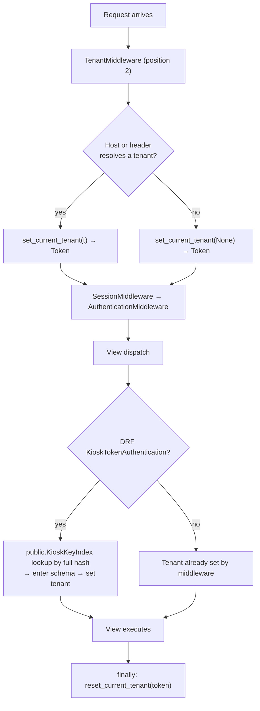

# Multi-Tenancy Feasibility Study

What it would take to serve RetailOps as a multi-tenant service - one system serving many
independent retail businesses - and which isolation model to adopt.

This is a decision document. It records a recommendation and the reasoning behind it. No
code has been changed as a result of writing it.

**Companion reading:** `ARCHITECTURE.md` describes the system as it exists today. This
document assumes that context.

## How to read the claims in this document

| Marking | Meaning |
|---|---|
| **Verified** | Checked against source at the cited `file:line` while writing this document. |
| **Projected** | An estimate or consequence derived from verified facts. Reasoned, not measured. |

Every structural claim in sections 1 to 4 is verified. Effort and cost claims in sections
5 onward are projected.

> **Verified 2026-09-28** against RetailOps Core `bd394d5`, Konteo Express `6242108`, and
> RetailOps CLI `23e89bc`. Every claim, count, and `file:line` reference holds at those
> commits. Section 13 records how each count was produced, so the next refresh can repeat
> it; the revision history at the end records what changed since the first version.

**Assumptions confirmed with the project owner:**

- Target scale is **tens to low hundreds of tenants** - independent retail businesses, each
  running one to ten kiosk stations.
- **Requiring PostgreSQL in local development and CI is acceptable.**

Both materially shape the recommendation. If either changes, section 6 changes with it.

---

## 1. Scope and current state

RetailOps is single-tenant today: one deployment serves one business. There is no partial
tenancy to build on. **Verified:** the codebase contains no tenant, organization, company,
or branch concept in any form; no `django-tenants`; no `DATABASE_ROUTERS`; no
`threading.local`, `contextvars`, or `get_current`-style ambient context; no `CACHES`
configuration; a single `DATABASES['default']`; and no deployment automation beyond CI
running `check`, `makemigrations --check`, and `test` against SQLite.

Every query in the application is a flat global-namespace query.

The one store-shaped concept is `KioskStation.store_identifier` (`core/models.py:1077`), a
free-text `CharField(max_length=50)` with no uniqueness, no foreign key, and no registry.
**Verified: it filters exactly one query** - the duplicate-station check in
`provision_kiosk` (`core/management/commands/provision_kiosk.py:24`), which enforces
uniqueness rather than scoping data. It appears in `unique_together`
(`core/models.py:1098`), in the derived service-user email
(`api/kiosk/provisioning.py:44`), and in Django admin `list_display`/`list_filter`. It is a
naming convention for hardware, not a tenancy axis, and it cannot be promoted in place.

### The query surface, counted

**Verified** counts of sites that read or write business data without any ownership filter.
A site is one manager access - `Model.objects` followed by a method, whether on the same
line or the next - or one `get_object_or_404(` call:

| Location | Count | Shape |
|---|---:|---|
| `core/views.py` | 63 manager accesses + 26 `get_object_or_404(` = **89** | 45 function-based views across 49 routes. No shared base class. |
| `api/views/*.py` | **32** | 9 collection querysets (4 `get_queryset()` overrides + 5 class-level `queryset =`) plus ad-hoc manager calls inside actions. |
| `api/kiosk/views.py` | **13** | All plain `APIView`. No queryset layer to hook. |
| `api/kiosk/` other modules | **7** | Station authentication, provisioning, and customer registration. |
| `api/serializers/*.py` | **16** | 8 write-side related fields (`queryset=`), plus 8 other queries - 5 of them uniqueness pre-checks. See section 8. |
| `core/models.py` | **12** | Model-level rules: sequence numbers, snapshot interning on each new payment, the settings singleton and its currency checks, the primary-recipient rule. |
| `core/services/*.py` | **5** | Stock (`inventory.py`), national-ID lookup (`customers.py`), and the live currency read (`currency.py`). |
| `core/admin.py` | 12 `ModelAdmin`, **0** `get_queryset()` overrides | Plus unfiltered `raw_id_fields` lookups (7). |

Call it **roughly 175 sites** in total. The distribution matters more than the sum, and
section 6 explains why.

Across every surface there are also **20 uniqueness pre-checks** - code that looks for an
existing row with the same unique value before writing: 10 in `core/views.py`, 5 in the API
serializers, 2 in the kiosk, 1 in the receipt-verify endpoint, the national-ID check in
`core/services/customers.py` that the API, the kiosk, and three back-office paths share,
and `provision_kiosk`'s station check.
Each is a global query today.

---

## 2. Blocker inventory

Ranked by launch-blocking severity - what stops you shipping, and what loses money after
you ship. All entries **verified**.

### 2.1 Unscoped recipient matching - a fraud vector, not a leak

`api/kiosk/views.py:634-638`:

```python
if settings.recipient_validation_enabled:
    profiles = RecipientProfile.objects.filter(
        is_active=True, payment_method=payment_method,
    )
    recipient_match = match_recipient_profile(vepay_data, payment_method, profiles)
```

`RecipientProfile` is the allowlist of bank accounts the business will accept payment into.
On a shared schema this query returns **every tenant's** accounts. A receipt showing payment
into tenant A's account would validate as a legitimate payment at tenant B's kiosk, and the
customer would walk out with goods.

This is not a data-disclosure problem. It is direct inventory loss, available to anyone who
knows any tenant's published payment details - which are, by design, published to customers
on the kiosk screen: Konteo Express's payment-account screen shows the store's primary
receiving account, with copy buttons, before every receipt payment. The same unscoped read
appears in `SystemSettings.clean()`
(`core/models.py:860`), so a tenant could enable recipient validation while owning zero
profiles of its own.

It ranks first because the constraint problems below stop you from launching, and this one
loses money quietly after you launch.

### 2.2 `SystemSettings` is a destructive singleton

`core/models.py:869-876`:

```python
def save(self, force_insert=False, force_update=False, using=None, update_fields=None):
    self.pk = 1
    update_fields = self._stamp_manual_rate_change(update_fields)
    super().save(
        force_insert=force_insert,
        force_update=force_update,
        using=using,
        update_fields=update_fields,
    )
```

The primary key is overwritten **unconditionally**. There is no guard and no exception: a
second tenant's `SystemSettings(...).save()` silently overwrites the first tenant's row.
That row holds the currency configuration, the live secondary exchange rate, the OCR
provider base URL and **`ocr_api_key`**, receipt retention policy, and
`recipient_validation_enabled`.

This ranks first *by ordering* - nothing else works until it is resolved - but **not by
cost**. Non-test code reads the singleton through two chokepoints. Twenty calls go through
one classmethod (`core/models.py:919-922`):

```python
@classmethod
def get(cls):
    obj, _ = cls.objects.get_or_create(pk=1)
    return obj
```

The second is `current_context()` (`core/services/currency.py:172`), which reads the row with
`SystemSettings.objects.filter(pk=1).first()` so that rendering a page or recording a payment
never inserts it; every new payment passes through it to record its currency. Beyond the two,
only setup and admin code touch the table directly: `OperationalSiteInitializer`'s
`get_or_create(pk=1)`, `SystemSettingsAdmin.has_add_permission`, and two re-reads of the
stored row inside `SystemSettings` itself.

Keeping both signatures zero-argument and backing them with ambient context means the context
processor, the `regional.py` template tags on every rendered money value, `VEPayClient`,
`Payment.save()`, and `Model.clean()` need no changes at all. The apparent size of this
blocker is an artifact of counting call sites instead of chokepoints.

Worth noting separately: `get()` performs a `get_or_create` on a **read** path executed on
every template render. That is an INSERT attempt on read, which will break under a
read-replica router and can race. Creation belongs in provisioning.

### 2.3 Identity: `User.email` and the single `Role` foreign key

`core/models.py:101` declares `email = models.EmailField(unique=True)` and it is the
`USERNAME_FIELD`. `role` is a single-valued FK (`core/models.py:104-110`) to a `Role` whose
`name` is itself globally unique (`core/models.py:69`).

One human therefore cannot work for two tenants, and cannot hold different roles at each.

**The important part is not the constraint.** Scoping the unique index is insufficient: the
**authentication backend must also filter by the current tenant**, or a user from tenant A
authenticates successfully against tenant B's subdomain. A mistake here logs someone into
the wrong company. This deserves its own deployment and its own tests.

### 2.4 Global uniqueness that collides in normal use

**Verified**, all in `core/models.py`. Beyond the identity constraints in section 2.3, twelve
uniques are global today and would each need a tenant component under a shared schema:

| Unique | Where | What happens across tenants |
|---|---|---|
| `Product.sku` | `:261` | Collides: generic SKUs, shared EAN codes. |
| `Customer.email` | `:149` | Collides: one shopper at two stores. |
| `Customer.national_id` | `:150` | Collides, and more readily now that it is stored normalised. |
| `ProductCategory.name` | `:199` | Collides: every store has "Beverages". |
| `SequenceCounter.prefix` | `:36` | One counter row per day shared by every tenant - order numbers would leak each tenant's volume to the others. |
| `SalesOrder.order_number`, `Payment.payment_number` | `:345`, `:606` | Unique only while the counter is shared; give tenants their own counters and both collide on the first order of the day. |
| `Payment.transaction_key` (partial) | `:645-649` | Collides only on a genuinely reused receipt, but see the oracle below. |
| `RecipientProfile` one primary per method (partial) | `:973-976` | Worse than a collision: the API and the back-office both call `demote_other_primaries()` (`:1002`) before setting a primary, which clears the flag on *every* other profile of that method - so one tenant choosing its receiving account silently strips another tenant's. `ensure_sole_profile_is_primary()` (`:1020`) likewise counts every tenant's profiles. |
| `RecipientProfile` unique combination | `:969-972` | Collides when two tenants receive into the same account. |
| `KioskStation` `(store_identifier, station_number)` | `:1098` | Collides when two tenants name a store alike. |
| `CurrencySnapshot.fingerprint` | `:526` | Does not error: two tenants with identical settings silently share one snapshot row, so the fingerprint needs a tenant component or the table a tenant FK. |

Generic SKUs, shared EAN codes, a category named "Beverages", the same shopper's national ID
at two stores - most of these collide immediately. `SalesOrderItem`'s one-line-per-product
constraint is the only unique that is already safe: it is scoped to its order.

`Payment.transaction_key` carries an extra hazard. `api/kiosk/views.py:531`:

```python
if transaction_key and Payment.objects.filter(transaction_key=transaction_key).exists():
    raise _DuplicateTransactionError(transaction_key)
```

Unscoped, this is a **cross-tenant existence oracle**: one tenant can probe for another
tenant's payment references by trial submission and read the answer from the error code.

### 2.5 The dashboard leaks revenue and customer names

`api/views/dashboard.py:83-124` contains **five unscoped queries in one method**: order
count for the month (`:87`), revenue `Sum` (`:91-98`), pending-payment count (`:102`),
low-stock count via a `Product` annotation (`:109-118`), and the five most recent orders
(`:120-124`) - which are serialised with `order.customer.get_full_name()`.

On a shared schema, `GET /api/v1/dashboard/` would hand every tenant the whole installation's
revenue and a sample of competitors' customer names.

### 2.6 Media path routing

Upload paths carry no tenant segment: `products/{YYYY}/{MM}/...` (`core/models.py:234`) and
`receipts/{YYYY}/{MM}/...` (`core/models.py:581`). Beyond the absence of isolation, the
human-readable segment leaks across tenants - a receipt object key embeds another tenant's
order number.

The fix has a trap, described precisely in section 4.

---

## 3. A prerequisite already met: no lock held across third-party HTTP

Shared-schema tenancy has one precondition in the current single-tenant system: kiosk
checkout must not hold a global row lock while it waits on a third-party service. If it did,
one tenant's degraded OCR provider would stall checkout for every other tenant on the box.

**Verified: it does not.** `_execute_checkout` validates the receipt - the VEPay OCR call
included - before it opens the transaction (`api/kiosk/views.py:335`). Inside it, the write
block re-resolves the products under row locks, re-checks stock and the total the receipt was
validated against, and re-checks the transaction key; nothing read before the block is
trusted. The `SO-{today}` counter row that `SequenceCounter.next_value()` locks is therefore
held only for database work. `VEPayClient` also budgets the whole call, retry included, at
`ocr_timeout_seconds` - 30 seconds by default.

The first version of this study found it as a live bug; it was fixed on 2026-08-03 (see the
revision history).

---

## 4. Two claims to state precisely

Both of these are easy to overstate, and an overstated claim discredits the rest of a
document once a reader checks it.

### 4.1 The storage prefix trap

`retailops/storage.py:125-131` routes objects to one of three backends by **leading string
match**:

```python
def _storage_for_name(self, name):
    normalized = str(name or '').replace('\\', '/').lstrip('/')
    if normalized.startswith(self.product_prefixes):   # ('products/',)
        return self.product_storage
    if normalized.startswith(self.receipt_prefixes):   # ('receipts/',)
        return self.receipt_storage
    return self.default_storage
```

The obvious tenant-prefixing change - `t/acme/receipts/...` - makes both tests fail, so the
object falls through to `default_storage`.

**The accurate consequence:** receipts are silently demoted from the receipt storage profile
to the default profile. That means a **different bucket** when three are configured
(`MEDIA_GCS_RECEIPT_BUCKET_NAME` vs `MEDIA_GCS_DEFAULT_BUCKET_NAME`), with whatever
lifecycle and retention policy was tuned for general media rather than for payment evidence,
and **without** the `private, max-age=0, no-store` cache-control that the receipt profile
applies by default.

It is **not** unconditionally public. `default_querystring_auth` defaults to `True`
(`retailops/settings.py:349`), so such objects would still be signed under default
configuration. Exposure is config-dependent: it requires
`MEDIA_GCS_DEFAULT_SIGNED_URLS=False`.

**The conclusion is unchanged and the fix is cheap:** the tenant segment goes *after* the
type prefix - `products/{tenant}/{YYYY}/{MM}/` and `receipts/{tenant}/{YYYY}/{MM}/` - which
requires no change to `storage.py` at all.

A migration note that is easy to miss: `_storage_for_name` drives `_open`, `_save`,
`delete`, `url`, and `exists`. Changing the scheme for *existing* files means physically
copying blobs, not rewriting database paths. The way to avoid that entirely is described in
Phase 4.

### 4.2 Late binding is not a kiosk special case

It is tempting to frame kiosk authentication as the one awkward path. The real distinction
is between two sources of tenant identity:

| Source | Available where | Used by |
|---|---|---|
| **Request envelope** - `Host` header, or an explicit header | Middleware, before any authentication | Back-office, CLI, MCP |
| **Credential** - the `KioskKey` API key | Only after DRF authentication runs, which is *after* all middleware | Kiosk stations |

The kiosk falls into the second bucket because a station is a fixed-configuration device in
a shop, not a browser following a link. Framing it this way makes a two-phase resolver
obviously necessary rather than a special case bolted on, and it generalises to any future
credential-derived scheme.

---

## 5. Isolation models evaluated against this codebase

### (a) Shared database, shared schema, tenant foreign key

Add a `tenant` FK to all 15 models, convert every global unique to a composite, and filter
every query.

**What it costs here.** The ~175 sites, and it is not a one-time cost. Every future pull
request that adds a query is a potential cross-tenant breach. The twelve uniques in section
2.4, plus `User.email` and `Role.name`, need concurrent index swaps with
`SeparateDatabaseAndState` reconciliation to keep `makemigrations --check` green in CI.

**What it solves.** One database, one `migrate`, one connection pool, one backup. Crucially,
**cross-tenant reporting stays a single query** - "orders across all customers this month",
which is a question you will want to answer about your own product. Under every other model
that becomes a rollup job. This advantage is real and routinely underpriced.

**What it does not solve.** Blast radius is total: one missing `.filter(tenant=)` exposes
everything. Per-tenant restore means restoring the whole database to a scratch instance and
copying rows back in foreign-key order across 15 tables - a bespoke script you will write
once and exercise for the first time during an incident.

### (b) Shared database, schema per tenant

One PostgreSQL schema per tenant, selected by `search_path`.

**Verified blockers that disappear entirely, with no code changes:**

| Blocker | Fate |
|---|---|
| 2.1 Unscoped recipient matching | **Gone.** The query sees only its own schema. |
| 2.2 `SystemSettings` `pk=1` | **Gone - becomes correct by construction.** One row per schema. `self.pk = 1` is now right. Neither chokepoint, nor any of the 20 `get()` calls, changes. |
| 2.3 `User.email` / `Role.name` uniques | **Gone** as constraints. The design question - can one human serve two tenants - remains a product decision. |
| 2.4 All twelve global uniques | **Gone.** Zero migrations - and `CurrencySnapshot` rows can no longer be shared between tenants. |
| 2.4 `transaction_key` existence oracle | **Gone.** |
| ~175 unscoped query sites | **All correct, untouched.** |

Three consequences deserve emphasis because they are not obvious:

**The 8 write-side `PrimaryKeyRelatedField(queryset=...)` vectors become safe for free.**
Under (a) these are genuinely awkward: the `QuerySet` is lazy but the *manager's*
`get_queryset()` runs at import time, so an ambient-context-reading manager would freeze a
`tenant IS NULL` clause into the field, forcing a `get_fields()` override or a custom field
on all eight. Under (b) nothing is frozen - `search_path` binds at SQL **execution** time.
`Product.objects.all()` at `api/serializers/inventory.py:76` and the
`__import__('core.models', fromlist=['Customer']).Customer.objects.all()` hack at
`api/serializers/order.py:116` both become correct as written.

**The `_stock` JOIN aggregate stops being a problem.** `Sum('inventory_movements__quantity')`
is a compiler-built JOIN that no manager intercepts. Same schema, both tables, correct.
`api/filters.py:28-39` keeps its hard dependency on the `_stock` alias with no accommodation.

**`pg_dump -n acme` and `DROP SCHEMA acme CASCADE`** turn per-tenant backup, export, and
deletion from bespoke scripts into one-liners.

**What it costs.**

- PostgreSQL in development and CI. `_sqlite_database_config` is currently the default branch
  and `retailops/test_runner.py` would need rework. *(Accepted by the project owner.)*
- `INSTALLED_APPS` splits into shared and tenant sets. `core` holds `User`,
  `SystemSettings`, and `KioskStation`, so `core` goes wholly tenant-side.
- `migrate_schemas` runs N times. At tens-to-low-hundreds this is minutes.
- **PgBouncer must run in session pooling mode.** `SET search_path` does not survive
  transaction-scoped connection reuse, and the failure is silent and catastrophic. Settings
  already expose `CONN_MAX_AGE`, so pooling is clearly anticipated. This is a hard
  operational constraint that belongs in the runbook, not in a postmortem.
- `search_path` is a *default*, not a *restriction* - schema-qualified raw SQL bypasses it.
- Cross-tenant reporting for you as the vendor becomes a rollup job. `OcrCallLog` is the
  concrete case: billing OCR usage across tenants now needs infrastructure.

**The one place (b) genuinely hurts: kiosk authentication.**

`api/kiosk/authentication.py:39-45` resolves a station by querying `KioskStation` - but that
table lives in a tenant schema, and you cannot know which schema without first finding the
station. Chicken and egg.

The resolution is a small public-schema index: `public.KioskKeyIndex(api_key_hash, tenant)`.
Authentication queries public for the hash, enters the tenant schema, then verifies
`is_active` and loads the station.

**Key it on the full SHA-256 hash, not the 8-character prefix.** `api_key_prefix` is
`db_index=True` but *not* unique (`core/models.py:1080`); today the lookup disambiguates by
passing both prefix and hash, and a prefix-keyed public index would reintroduce exactly the
ambiguity the current code avoids. The hash discloses nothing.

Cost: roughly 40 lines and one public model, plus the requirement that key rotation and
deactivation write both places atomically. Everything already routes through
`api/kiosk/provisioning.py`, which is already transactional; the admin bulk actions in
`core/admin.py:187-207` would need the same treatment. This is the only structural cost (b)
imposes that (a) does not.

### (c) Database per tenant

Everything (b) solves, plus true blast-radius isolation and per-tenant restore that is an
actual restore.

Disqualified on operations, not on design. N databases to migrate, with no Dockerfile, no
compose file, no deployment automation, and CI that currently runs on SQLite. Migration
orchestration is not a detail here - it is the entire job. Secondary: PostgreSQL
`max_connections` becomes the ceiling (workers x tenants x `CONN_MAX_AGE`), and Django
cannot express foreign keys across databases, so nothing can reference the `Tenant` model.

Reasonable later as a premium tier for a regulated customer. Wrong as the primary model now.

### (d) Instance per tenant (silo)

**Zero code changes.** Ship the current codebase N times with N environment files. Every
blocker in section 2 evaporates: `pk=1` is correct, all ~175 sites are correct, kiosk auth is
unchanged.

The honest framing, which usually gets skipped: silo does not eliminate engineering, it
**relocates it from Django to operations**. Cost is N x (application server + database +
buckets + TLS certificate + configuration + *upgrade*), linear in N with no economies of
scale. For a team that has not yet written a Dockerfile, that is a bad long-run trade.

But it has one property nothing else has: **a coding mistake cannot cause a cross-tenant
breach.** For a system handling bank transfer receipts and OCR-verified payments, that is
worth real money.

Its correct role is a **bridge, not a destination**.

### Blocker fate summary

| Blocker | (a) discriminator | (b) schema | (c) database | (d) silo |
|---|---|---|---|---|
| Unscoped recipient match (fraud) | Scope the query | **Gone** | Gone | Gone |
| `SystemSettings` `pk=1` | Fix `get()` and `current_context()` (hours) | **Gone - correct** | Gone | Gone |
| `User.email` + auth backend | Composite + **custom backend** | Gone as constraint | Gone | Gone |
| Global uniques (12) | 12 concurrent index swaps | **Gone** | Gone | Gone |
| Dashboard aggregates | Scope 5 queries | **Gone** | Gone | Gone |
| Media path routing | Type-prefix-first | Same fix | Same fix | Per-tenant buckets |
| ~175 unscoped sites | **The entire project** | **Zero edits** | Zero edits | Zero edits |
| 8 import-time related fields | `get_fields()` on all 8 | **Gone - lazy binding** | Gone | Gone |
| `_stock` JOIN aggregate | Needs RLS to be safe | **Gone** | Gone | Gone |
| Kiosk late binding | **Easiest here** | Public key index (~40 lines) | Registry + router | N/A |
| Per-tenant backup / delete | Bespoke, fragile | **`pg_dump -n` / `DROP SCHEMA`** | Trivial | Trivial |
| Vendor cross-tenant reporting | **Trivial** | Rollup job | Warehouse | Warehouse |
| Ops cost at N=20 | Lowest | Low | High | **Prohibitive** |

---

## 6. Recommendation

**Adopt schema-per-tenant on PostgreSQL, with a public-schema kiosk key index. Use manual
instance-per-tenant deployments for the first three to five customers as a bridge. Keep the
shared-schema discriminator model as the documented fallback.**

The argument is one asymmetry, and it is worth stating plainly rather than burying it in the
matrix above:

> **89 of the ~175 unscoped query sites are in `core/views.py`**, spread across 45
> function-based views with no shared base class, no `get_queryset()`, and no permission
> hook. Under the discriminator model those are 89 individually-reviewed edits *and* a
> permanent per-pull-request security obligation. Under schema-per-tenant they are correct
> without being touched.

That converts an unbounded recurring cost into a bounded one-time cost, which is the single
most valuable property for a small team.

**Re-evaluated against `bd394d5`, the recommendation holds.** The asymmetry is unchanged in
proportion: `core/views.py` holds 51% of the sites today against 52% when the study was
first written, and it grew by six sites and two views in two months - the recurring cost
the argument is about, observed. The rest of the new evidence only strengthens the case: a
shared schema would need twelve composite uniques, not the five or nine the first version
counted; the primary-recipient rule would let one tenant silently demote another's
receiving account; and the currency snapshot table added in #10 would silently share rows
across tenants. Nothing new weighs against schema-per-tenant.

Supporting reasons, in order of weight:

1. **The highest-ranked structural blocker becomes free.** `SystemSettings`'s
   `self.pk = 1` - the line that would silently overwrite one tenant's OCR API key and
   exchange rate with another's - is not *fixed* under schema-per-tenant, it is *correct*.
   So are the context processor on every template render, the `regional.py` template tags on
   every money value, `current_context()` on every new payment, `VEPayClient.__init__`, and
   `SystemSettings.clean()`.

2. **Blockers 2.3 and 2.4 are constraint-shaped, and constraints are per-schema.** Fourteen
   composite-index migrations - the twelve uniques of section 2.4 plus `User.email` and
   `Role.name` - each needing a concurrent-create/drop sequence and migration state
   reconciliation, simply do not happen.

3. **Scale fits.** Tens to low hundreds puts `migrate_schemas` in the minutes range. The
   regime where schema-per-tenant degrades - thousands of tiny tenants - is not the target
   market.

4. **Per-tenant export, backup, and deletion come nearly free.** Under the discriminator
   model those are three bespoke scripts, written under time pressure and tested never.

5. **The kiosk survives intact.** The key-index workaround preserves the property that
   Konteo Express needs zero changes. Those are physical terminals in shops; a configuration
   change means a site visit.

**The decision hinge, stated honestly.** The strongest counter-argument is not technical
elegance - it is that (b) forces PostgreSQL into development and CI, adds a third-party
dependency to the Django upgrade path, and hard-constrains connection pooling to session
mode. The PostgreSQL requirement has been accepted; the other two are real and ongoing.

**A middle path worth costing.** Schema-per-tenant **without `django-tenants`**: roughly 150
lines of middleware issuing `SET search_path`, plus a `provision_tenant` command wrapping the
existing `OperationalSiteInitializer`. You get the isolation, drop the dependency and its
version-compatibility risk, and pay by writing your own migration orchestration for N
schemas. Given how much of `django-tenants` would be bypassed anyway - custom kiosk
authentication, custom provisioning - this is more attractive than it first appears. Cost
both before committing.

---

## 7. Tenant resolution design

### Use `contextvars`

Not thread-locals, not a request attribute as the source of truth, not explicit parameter
passing. The reasons are specific to this codebase.

**Explicit passing is structurally impossible.** The consumers are ambient call sites with
no request in scope:

- `VEPayClient.__init__` calls `SystemSettings.get()` with no arguments
  (`core/services/vepay.py:73`) and is constructed as a bare `VEPayClient()` at
  `api/kiosk/views.py:599`.
- `Model.clean()` is called by Django **with no arguments**. `SystemSettings.clean()`
  (`core/models.py:860`) reads `RecipientProfile`. You cannot pass a tenant into it.
- `Payment.save()` records the live currency configuration on every new payment through
  `current_context()` (`core/models.py:663`) - a model method, called from the API, the
  back-office, the kiosk, and the seed command alike.
- `core/templatetags/regional.py` runs during template rendering on every money value.
- `purge_receipts` and `update_bcv_rate` are management commands with no request at all.

**Thread-locals are actively unsafe here.** `asgi.py` exists, and
`async_to_sync(VEPayClient().parse_receipt)` is already in the checkout path with
`asyncio.to_thread` inside `parse_receipt`. `asyncio.to_thread` explicitly performs
`contextvars.copy_context()` and runs the target via `ctx.run(...)`: **context variables
propagate across that hop by design; thread-locals do not.** Under ASGI it is worse - the
thread pool reuses threads across requests, so a leaked value becomes a cross-tenant read.

`request.tenant` remains a useful convenience mirror for templates and views. It is not the
source of truth.

### The module

`core/tenancy.py` exposing a `ContextVar`, `get_current_tenant()`, `set_current_tenant()`
returning a `Token`, `reset_current_tenant(token)`, and a `tenant_context(t)` context
manager that resets in a `finally`.

**Always reset with the `Token`, never by setting `None`.** `ContextVar.reset(token)`
restores the *previous* value, which is what makes nesting work - and nesting will happen, in
`provision_tenant` and in every management command that loops tenants.

### Two-phase resolution



**Middleware position is a hard constraint, not a preference.** Under schema-per-tenant the
`User` table is schema-local, so resolving `request.user` itself requires `search_path` to be
set. `TenantMiddleware` must therefore precede **both** `SessionMiddleware` and
`AuthenticationMiddleware` - position 2 in `MIDDLEWARE`, immediately after
`SecurityMiddleware`, where `KioskCORSMiddleware` currently sits.

`ALLOWED_HOSTS` needs no code change: Django's leading-dot wildcard means
`DJANGO_ALLOWED_HOSTS=.retailops.app` covers every tenant subdomain, and the existing CSV
parsing (`retailops/settings.py:69-74`) passes it through unchanged.

**The teardown problem, and the trick that solves it.** DRF's authentication layer has no
teardown hook - nothing unwinds what `authenticate()` sets. The fix is that **the middleware
always establishes a Token, even when it resolves no tenant**, and always resets it:

```python
token = set_current_tenant(resolved_or_None)
try:
    return self.get_response(request)
finally:
    reset_current_tenant(token)
```

The outermost frame owns the lifetime, so anything DRF sets deeper in the stack is discarded
on the way out. No DRF lifecycle changes, no signal hooks, and it generalises to any future
credential-derived scheme.

**Harden the existing pattern while you are there.** `RegionalMiddleware`
(`core/middleware.py:83-97`) already does exactly this shape - activate request-scoped state,
deactivate on the way out - and the authors clearly understood the bleed hazard. But it calls
`timezone.deactivate()` after `get_response` **without** a `finally`. In Django's normal
chain `convert_exception_to_response` usually makes this hold; a middleware above it raising,
or a test driving it via `RequestFactory`, leaks the state. For a timezone that is cosmetic.
For a tenant it is a cross-tenant exposure. The pattern is 90% right and needs the last 10%.

### An invariant nothing currently enforces

If a request arrives at `acme.retailops.app` carrying a `KioskKey` belonging to `bodega`,
**reject it with 401.** Do not let the credential silently override the envelope. There is
currently no place this could even be checked. It is roughly five lines in `authenticate()`
and it converts a confused-deputy class of bug into a hard failure.

---

## 8. Enforcement: what each layer actually catches

Django's manager semantics decide which layers are necessary, and they are subtler than the
usual "add a default manager" advice.

| Access path | Filtered by a tenant-aware `_default_manager`? |
|---|---|
| `Model.objects.<anything>` | **Yes** |
| `get_object_or_404(Model, pk=...)` | **Yes** - uses `_default_manager` |
| Reverse FK / M2M managers (`order.items.all()`) | **Yes** |
| Forward FK attribute (`payment.sales_order`) | **No** - uses `_base_manager` |
| Relation spans in `filter()` / `annotate()` | **No** - compiler-built JOIN, no manager |
| `select_related()` | **No** |
| Raw SQL / `.extra()` | **No** |
| Cascade-delete collector | **No** - and correctly so |
| `PrimaryKeyRelatedField(queryset=...)` at import | **Frozen wrong** under (a) |

Two consequences change the effort estimate:

- **The 26 `get_object_or_404` sites in `core/views.py` are among the cheapest to fix, not
  the hardest** - a default manager catches all of them. That reduces the effective
  `core/views.py` burden under (a) from 89 to 63.
- **The "scope the root, trust the FK" strategy silently depends on tenant-consistent
  foreign keys, and nothing in the codebase enforces that.** This is a bigger finding than
  the `_stock` aggregate itself. A `Product` scoped correctly does constrain
  `Sum('inventory_movements__quantity')` transitively - *provided* no movement ever points at
  another tenant's product.

One asset worth naming: `api/views/product.py:17` `_annotated_products()` is a **single
function** owning the `_stock` annotation, and it is the ViewSet's only `get_queryset()`.
`api/filters.py`'s hard dependency on the `_stock` alias is satisfied by scoping one
function.

### The layers

| Layer | Catches | Misses | Verdict |
|---|---|---|---|
| **0. `search_path`** (option b) | Every row in the table above except schema-qualified raw SQL; all 89 `core/views.py` sites, all kiosk `APIView` queries, all 8 related fields, all 20 uniqueness pre-checks, all 12 `ModelAdmin`s | Explicit `schema_context('public')`; schema-qualified raw SQL | **The primary control under (b)** |
| **1. Tenant-aware default managers** (option a) | Rows 1-3 | Rows 4-8 - where the residual risk lives | Necessary but insufficient under (a) |
| **2. Base ViewSet mixin** | The 9 collection querysets | The ad-hoc action queries (`order.py` `bulk_transition`, `inventory.py` `bulk_adjust`), all kiosk `APIView`s, all 89 `core/views.py` sites, all write-side related fields | **~5% of the surface. Never cite it as a control.** |
| **3. `has_object_permission`** | IDOR on detail routes after someone forgets to scope `get_queryset()` | All list routes, all `core/views.py` FBVs, the kiosk `APIView`s, every write through a related field | Narrow, but that is the *most likely* mistake, and it is ~20 lines. **Do it regardless of model.** |
| **4. PostgreSQL Row-Level Security** | Everything, including JOIN aggregates, `_base_manager` traversal, `select_related`, and raw SQL | Nothing at the data layer | Under (a) this is not defence-in-depth, it is **the** control |
| **5. Test-suite guard** | See section 9 | Nothing it is pointed at | **Cheapest high-value layer. Mandatory under every model.** |

Two design points that matter more than the manager itself, if (a) is ever chosen:

- **Do not set `Meta.base_manager_name` to a filtering manager.** Django explicitly
  discourages it; it breaks `select_related`, cascade deletes, and `refresh_from_db` in ways
  that produce silent data corruption rather than errors.
- **When the context is empty, raise - do not return `.none()`.** Silent empty results
  produce "the dashboard shows zero orders" bugs that get diagnosed as data problems. An
  exception produces a stack trace pointing at the missing context. Provide an explicit
  all-tenants escape hatch. Be aware this makes `manage.py spectacular`, `dumpdata`, and the
  seed command raise until they are wrapped.

**On Row-Level Security, lead with the failure mode.** `FORCE ROW LEVEL SECURITY` is the
whole ballgame:

```sql
ALTER TABLE core_salesorder ENABLE ROW LEVEL SECURITY;
ALTER TABLE core_salesorder FORCE ROW LEVEL SECURITY;
CREATE POLICY tenant_isolation ON core_salesorder
  USING (tenant_id = current_setting('retailops.tenant_id')::int);
```

**Table owners bypass RLS by default.** If Django's database user owns the tables - which it
does if it ran the migrations - then without `FORCE`, RLS is enabled, looks correct in
`\d+`, and does nothing. Either force it or run migrations as an owner role and the
application as a separate restricted role. Test this explicitly: a test asserting "tenant B's
rows are invisible" that passes against a non-forced policy is the worst possible outcome.

Two frictions specific to this codebase: `ATOMIC_REQUESTS` is `False`, so most requests run
in autocommit and `SET LOCAL` has no transaction to scope to - you need a session-level `SET`
at connection checkout plus per-request reassertion. And with `CONN_MAX_AGE > 0` a stale
setting persists onto a reused connection, so it must be set on **every** request. This is
the same session-pooling constraint as `search_path`, so under (b) it is already paid for.

---

## 9. The test guard

The highest-leverage artifact in the entire project, and it should be built in Phase 0 -
against the single-tenant application with a stub tenant - so it is ready before it is
needed.

**The two-tenant sweep.** Create tenants A and B with structurally identical data. Enumerate
every route from `get_resolver().reverse_dict` - 49 back-office routes plus the API router -
and drive each one as a tenant-A user. Then assert:

1. No tenant-B primary key, SKU, email, national ID, order number, or customer name appears
   in any response body.
2. Every detail route returns **404 - not 403, and not 200** - for a tenant-B object id.

One mechanical implementation covers list routes, detail routes, the five dashboard
aggregates including the customer names at `api/views/dashboard.py:120-124`, the HTML
back-office, and the kiosk endpoints.

Three cheap companions:

- **Model census.** Iterate `apps.get_models()` and assert every `core` model either carries
  a tenant FK (under (a)) or appears in an explicit exemption set. Under (b), assert the
  shared and tenant app sets partition `INSTALLED_APPS`. This fails the day someone adds a
  model without deciding its tenancy - the regression that *will* happen, and already has
  once: `CurrencySnapshot` (#10) became the fifteenth model two months after this study
  counted fourteen.
- **Cross-tenant FK integrity.** For every foreign key between tenant-scoped models, assert
  `source.tenant_id == target.tenant_id`. This protects the assumption the whole strategy
  rests on and that nothing currently enforces.
- **SQL predicate wrapper.** Via `connection.execute_wrapper` in tests, assert every
  statement against a scoped table carries a tenant predicate. Cruder and noisier than the
  sweep, but it reaches paths the sweep cannot - management commands and background jobs.

If (a) is ever chosen, the rigorous version of the FK check is structural rather than
tested: `UNIQUE(id, tenant_id)` on each parent plus a composite
`FOREIGN KEY (parent_id, tenant_id)` on each child. Django cannot express composite foreign
keys but `RunSQL` can. That is up to 8 extra unique indexes - one per referenced parent
table - and up to 19 composite FKs, one per relationship between the models, and it makes
cross-tenant corruption *impossible* rather than *detected later* - the correct answer for a
payments-adjacent system on a shared schema.

---

## 10. Phased migration

Every phase ships. Nothing sits on a long-lived branch.

### Phase 0 - Hygiene (valuable single-tenant, ship independently)

The checkout lock that once headed this list is already fixed (section 3).

1. **Configure `CACHES`.** Currently absent, so throttling uses per-process `LocMemCache`:
   the `600/min` global ceiling is really `600 x worker_count` and resets on every deploy.
   Per-tenant throttling is impossible until a shared cache exists, and the VEPay circuit
   breaker in section 11 needs it too.
2. **Add PostgreSQL to CI** as a matrix leg.
3. **Write the two-tenant sweep harness** against the single-tenant app.
4. **Add `has_object_permission` backstops** - no-ops today, live later.

### Phase 1 - Tenant model and resolution, no enforcement

`public.Tenant(slug, name, schema_name, is_active, created_at)` and
`Domain(host, tenant, is_primary)`. **Design `Domain` in now** even though custom domains are
a year away; retrofitting means touching the resolver a second time.

Add `core/tenancy.py`, `TenantMiddleware` at position 2 with `try`/`finally` Token
discipline, the kiosk phase-2 resolution, and the envelope/credential agreement check.

Ships with exactly one tenant configured. Behaviour is byte-identical. **Shippable.**

### Phase 2 - Data migration

**Under (b):** `CREATE SCHEMA default_tenant`, then `ALTER TABLE ... SET SCHEMA` per table.
These are **metadata-only operations**, so the maintenance window is seconds to minutes, not
hours. Create the `public.Tenant` row. This is the one genuinely disruptive step and it is
small.

**Under (a),** for reference: add `tenant` as nullable (no table rewrite on PostgreSQL 11+),
backfill in batches, then `SET NOT NULL` **via** a `NOT VALID` CHECK constraint plus
`VALIDATE CONSTRAINT` - which takes only a `SHARE UPDATE EXCLUSIVE` lock - rather than
naively, which takes `ACCESS EXCLUSIVE` for a full table scan.

Unique constraints cannot be replaced atomically, so per constraint:
`CREATE UNIQUE INDEX CONCURRENTLY` (needs `RunSQL` in a migration with `atomic = False`, or
`AddIndexConcurrently`; `AddConstraint` will not do it) → deploy code that no longer depends
on the global unique → `DROP INDEX CONCURRENTLY` → **reconcile migration state with
`SeparateDatabaseAndState`**, which is non-negotiable because CI runs
`makemigrations --check`.

**`User.email` deserves its own sub-phase**, because of the authentication-backend issue in
section 2.3. Isolate it, test it specifically, deploy it alone.

**Shippable.**

### Phase 3 - Enforcement

**Under (b):** flip the middleware to actually issue `SET search_path`. All ~175 sites become
correct simultaneously. Run the sweep. This is the payoff, and it is one commit.

**Under (a):** add managers model by model, highest blast radius first - `SalesOrder`,
`Payment`, `Customer`, `Product` - running the sweep after each. Then RLS with `FORCE`.

### Phase 4 - Residuals

- **Media paths:** `products/{tenant}/{YYYY}/{MM}/` and `receipts/{tenant}/{YYYY}/{MM}/` -
  type prefix first (section 4.1). **Do not migrate existing paths.** The default tenant's
  files stay where they are and still route correctly; only new uploads carry the tenant
  segment. Zero downtime, zero blob copying.
- **`purge_receipts` and `update_bcv_rate`:** loop tenants under `tenant_context`. Note that
  `update_bcv_rate` currently raises `CommandError` on a bad source URL - one tenant's
  failure must not abort the rest.
- **Admin:** `SystemSettingsAdmin.has_add_permission` (`core/admin.py:171`) currently returns
  `not SystemSettings.objects.exists()`, so under (a) once one tenant has settings no other
  can create theirs. Under (a) also add `get_queryset()` **and `formfield_for_foreignkey`**
  to all 12 `ModelAdmin`s - the latter is the admin's exact analogue of the related-field
  leak, and without it every FK dropdown lists other tenants' objects.
- **Kiosk provisioning email** (`api/kiosk/provisioning.py:44`): add the tenant slug, or the
  derived `kiosk-{store}-{n}@station.internal` collides on `User.email`.
- **`store_identifier`:** promote to a real `Store` FK, or at minimum add tenant to
  `unique_together`. Low priority - it is free text that filters only `provision_kiosk`'s
  duplicate check, so it is dead weight rather than a hazard.

### Phase 5 - Provisioning

`OperationalSiteInitializer.run()` (`core/management/site_initialization.py:256-292`) already
creates roles, settings, the admin user, and kiosk stations inside a single
`transaction.atomic()`. Wrapping it in a schema context yields
`manage.py provision_tenant --slug acme` in roughly thirty lines.

This is the strongest existing asset in the repository - the difference between "provisioning
is a project" and "provisioning is a command."

---

## 11. What stays hard

**Per-tenant OCR keys are free; attribution is not.** The keys already live in
`SystemSettings.ocr_api_key` rather than in environment variables, so per-tenant keys fall
out of breaking the singleton. But `OcrCallLog` becomes per-schema, so billing OCR usage
requires a nightly rollup into public. Price this in Phase 0, not at invoice time.

**The shared VEPay dependency has no clean answer.** Either a shared account, where one
tenant exhausting the quota breaks everyone, or per-tenant accounts, where you inherit N
vendor relationships and lose central debugging. Recommend per-tenant keys with a platform
fallback, plus a per-tenant quota enforced inside `VEPayClient` and driven by `OcrCallLog`.
Add a **per-tenant circuit breaker**: `core/services/vepay.py:102` makes up to two attempts
inside one `ocr_timeout_seconds` budget (30 seconds by default, since `408bfa0`), so a
degraded provider still costs up to that budget per request. The breaker needs the shared
cache from Phase 0.

**SMTP and sender identity.** Password-reset links already follow `request.get_host()` -
`django.contrib.sites` is not installed, so `get_current_site` falls back to `RequestSite` -
which means subdomain links work for free. A genuine asset. But `DEFAULT_FROM_EMAIL` is
global. Per-tenant sending means either per-tenant SMTP credentials (another secret, another
support surface) or one sender with a per-tenant display name and SPF/DKIM on your domain
only. The second is right at this scale, but it means tenants **cannot** send from their own
domain without DKIM delegation. That is a sales conversation, and it should be written down
before someone promises otherwise.

**Backup, restore, and deletion.** Under (b), `pg_dump -n acme` and `DROP SCHEMA acme
CASCADE`. Under (a), per-tenant restore means restoring the full database to a scratch
instance and copying rows back in FK order across 15 tables. This is where (a) is weakest and
it is almost never priced.

Media is a separate axis under every model: buckets are not tenant-partitioned unless the
*path* is. That is why the Phase 4 path change matters beyond hygiene - it is what makes
deleting one tenant's receipts a prefix operation rather than a database-driven object walk.

**Noisy neighbours are currently unaddressable.** No `CACHES` means per-process
`LocMemCache`, so the effective limit is `rate x workers` and it resets on deploy. Worse for
kiosks specifically: the kiosk throttles key on the **station**, so a tenant with 50 terminals
gets 50 times the budget of a tenant with one. A tenant-level scope must sit above the
station scope. And throttling cannot touch database contention at all - one tenant's report
scanning millions of rows needs a per-connection `statement_timeout`, set per tenant, which
is another thing the connection-setup hook must do alongside `search_path`.

**Custom domains leak into code in two non-obvious places.** `*.retailops.app` is free via the
`ALLOWED_HOSTS` wildcard. A tenant-owned domain needs the `Domain` table, per-domain TLS
automation you do not have, and: **`CSRF_TRUSTED_ORIGINS` is read from settings at import**,
so dynamic per-tenant origins need either a wildcard entry or custom CSRF middleware; and
**`KioskCORSMiddleware` builds its allowlist once in `__init__`** from one environment
variable, so per-tenant kiosk origins must become a request-scoped computation. Both fail
closed in confusing ways.

**Offboarding.** `pg_dump -n` is a *backup*, not a customer-usable *export*. You need
`dumpdata` inside a tenant context, a manifest, a media sync, and - critically - a test that
**round-trips the export into an empty tenant**. Without that round-trip test the export
format is aspirational.

**Two more, easy to forget.** Cross-tenant reporting *for you as the vendor* is permanently a
rollup job under (b) and (c). And `drf-spectacular` instantiates serializers and touches
querysets, so under (a) with a fail-closed manager `manage.py spectacular` raises until it is
wrapped - minor, but it will surprise someone in CI.

---

## 12. Client impact

### Konteo Express (kiosk) - zero code changes

A station's API key already resolves 1:1 to a `KioskStation`
(`api/kiosk/authentication.py:39-52`). Adding a tenant to that station makes every kiosk
request tenant-scoped **server-side**, with no client change. This property is worth
protecting: these are physical terminals in shops, and a configuration change means a site
visit.

Two provisioning-level items, not code:

- `BASE_URL` per station must point at the tenant's host. It is already per-station
  configuration via `config.local.js` or the native settings screen.
- The mixed-content guard rejects an `http://` `BASE_URL` when served over HTTPS, with
  loopback exempted. Correct behaviour for real tenant subdomains.

One opportunity: branding (`STORE_NAME`, `BRAND_LOGO_URL`, `KIOSK_THEME`) is client-side
configuration today, but `app/services/settings.js` already fetches `GET /settings/` at boot,
with a conservative-fallback `catch`, and again whenever a sale starts, keeping the last
applied values if that refresh fails. Serving branding from the tenant's settings row would
therefore reach every terminal at its next sale, and would reduce per-station configuration
to the two irreducible secrets - `BASE_URL` and `KIOSK_API_KEY` - which is exactly what
SaaS onboarding wants.

### RetailOps CLI - works unchanged under subdomain tenancy

Profiles are already `(base_url, token)` pairs with a full resolution chain, so
`auth login --url https://acme.retailops.app/api/v1 --profile acme` gives one operator
multi-tenant access with no code change. **This is a real argument for making the subdomain,
rather than a header, the primary mechanism** - a header-based scheme would need a new
`Profile` field.

Two latent issues worth fixing regardless:

- `set_profile_token` writes a fixed four-key dict, so any field added to a profile is
  **silently dropped on the next `auth login`**.
- The `kiosk` command group builds its client by reusing the *active profile's* `base_url`
  with the token swapped. A kiosk key from tenant A used while profile B is active would hit
  the wrong host - a genuine cross-tenant footgun once tenants exist.

### MCP server - inherits scoping for free

`mcp_server/` performs no ORM access; it is an HTTP client of `/api/v1/`. Whatever scoping the
API gains, the MCP layer gets automatically. Its `retailops://` resource URIs may want a
tenant segment for clarity, but nothing is required for correctness.

---

## 13. How this document is verified

The verified claims are re-derived at each refresh, never re-read. A refresh pins one commit
in each repository, then splits the document into claims - structural facts, counts,
`file:line` references, judgements - and ends each as verified, updated, or removed. A
`file:line` reference must land on the construct it names. Every count is first re-run at
the previous baseline: a rule that cannot reproduce the number the last version printed is
fixed before it is trusted. Judgements - the blocker ranking, the recommendation, the
phases - are re-evaluated only after every fact is settled.

The counts in this version, run from the repository root at `bd394d5`:

| Count | Value | Command or rule |
|---|---:|---|
| Manager accesses, per location | 63 / 32 / 13 / 7 / 16 / 12 / 5 | `git grep -ohE '\.objects(\.\|\s*$)' -- <path> \| wc -l` for `core/views.py`, `api/views/*.py`, `api/kiosk/views.py`, the other `api/kiosk/` modules, `api/serializers/*.py`, `core/models.py`, `core/services/*.py` |
| `get_object_or_404(` in `core/views.py` | 26 | `git grep -o 'get_object_or_404(' -- core/views.py \| wc -l` |
| Back-office views / routes | 45 / 49 | `grep -cE '^def [a-z]\w*\(request' core/views.py`; `grep -c 'path(' core/urls.py` |
| Collection querysets | 4 + 5 | `grep -c 'def get_queryset' api/views/*.py`; `grep -cE '^\s{4}queryset\s*=' api/views/*.py` |
| Write-side related fields | 8 | `grep -c 'queryset=' api/serializers/*.py` |
| `ModelAdmin`s / `get_queryset()` overrides / `raw_id_fields` | 12 / 0 / 7 | `grep -cE '^class \w+\((admin\.ModelAdmin\|BaseUserAdmin)\)' core/admin.py`, then `def get_queryset` and `raw_id_fields` |
| `SystemSettings.get()` calls outside tests | 20 | `git grep -c 'SystemSettings.get()' -- '*.py' ':!*tests/*' ':!*migrations/*'` |
| Uniqueness pre-checks | 20 | A query for an existing row with the same unique value before a write; listed by surface in section 1 |
| Global uniques needing a tenant component | 12 | `grep -nE 'unique=True\|UniqueConstraint\(\|unique_together' core/models.py`, less the identity pair of section 2.3 and the order-scoped `SalesOrderItem` constraint |
| Models / relationships | 15 / 19 | As in `ARCHITECTURE.md` section 17 |

The manager-access rule counts `Model.objects` followed by a method on the same line *or* at
the end of a line, where the chain continues below. The first version counted only the
same-line form; section 1 uses the complete rule, and the revision history gives both.

## Revision history

| Date | Baseline | Change |
|---|---|---|
| 2026-09-10 | Core `c391385` (2026-07-30) | First version, landed in #9. |
| 2026-09-28 | Core `5819e41` | #11: every `file:line` reference re-verified after the code had moved under it, with dated notes where a claim no longer held. |
| 2026-09-28 | Core `bd394d5`, Konteo Express `6242108`, RetailOps CLI `23e89bc` | Full re-verification (this version). See below. |

**What the full re-verification changed.**

- **The checkout lock is gone from the blocker list.** The first version's section 2.2 and
  section 3 documented a live bug: kiosk checkout held the day's `SequenceCounter` row lock
  - taken by `order.save()` inside an outer `transaction.atomic()` - across the VEPay call,
  up to 61 seconds with a retry, serialising all order creation behind a third-party
  service. `d17f065` (#5, 2026-08-03) applied exactly the fix section 3 prescribed, and
  `408bfa0` capped the whole VEPay call at `ocr_timeout_seconds`. Section 3 now records the
  prerequisite as met; the fate table and Phase 0 no longer carry it. Blockers 2.3-2.7
  became 2.2-2.6.
- **Counts re-derived.** With the first version's same-line rule, `core/views.py` went from
  78 sites (reproduced at `c391385`) to 81; with the complete rule, from 83 to 89, and the
  total from about 159 to about 175. Views 43 to 45, routes 47 to 49, API views 23 to 22
  (32 at both baselines under the complete rule), kiosk views 10 to 11 (12 to 13 complete),
  `ModelAdmin`s 11 to 12, models 14 to 15. New rows: `core/models.py`, `core/services/`, and
  the kiosk's other modules.
- **Figures that could not be reproduced by any rule** - "13 uniqueness checks" and "~35"
  `SystemSettings.get()` call sites, and "nine" composite constraints against the fate
  table's "five" - are replaced by explicit rules and lists: 20 uniqueness pre-checks, 20
  `get()` calls plus `current_context()`, and twelve global uniques.
- **New findings.** `CurrencySnapshot.fingerprint` would share rows across tenants;
  `SalesOrder.order_number` and `Payment.payment_number` collide once counters are
  per-tenant; the primary-recipient rule would let one tenant demote another's receiving
  account; `current_context()` is a second settings chokepoint.
- **Corrected.** "`store_identifier` never filters a query" was already untrue when first
  written: `provision_kiosk` has filtered on it since June.
- **The recommendation was re-evaluated and holds** - section 6 gives the reasoning.
