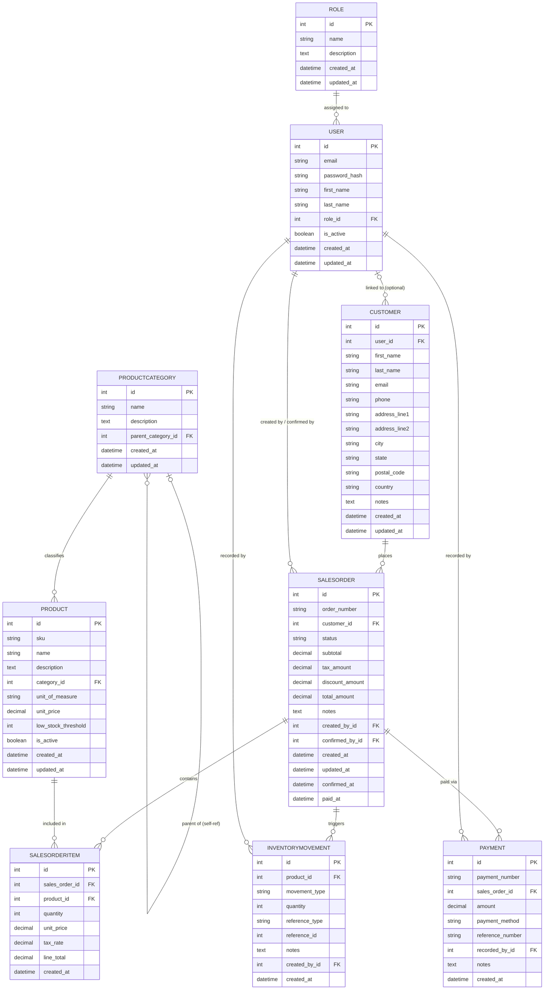

# RetailOps — Entity Relationship Diagram

## Mermaid ERD

## Cardinality Legend

| Symbol | Meaning |
|--------|---------|
| `\|\|` | Exactly one (mandatory) |
| `\|o` | Zero or one (optional) |
| `o{` | Zero or many |
| `\|{` | One or many (mandatory) |

**Reading examples:**
- `ROLE ||--o{ USER` → One Role is assigned to zero-or-many Users; each User has exactly one Role.
- `USER |o--o{ CUSTOMER` → A User is optionally linked to zero-or-many Customers; a Customer optionally has one linked User.
- `PRODUCTCATEGORY |o--o{ PRODUCTCATEGORY` → A category optionally has one parent; a parent category optionally has many child categories.

## Notes

- `INVENTORYMOVEMENT.quantity` is signed: positive = stock addition, negative = stock deduction.
- `INVENTORYMOVEMENT.reference_type` + `reference_id` form a generic (non-FK) reference to the originating record.
- `SALESORDERITEM.unit_price` is a price snapshot captured at order time, independent of the current `PRODUCT.unit_price`.
- `SALESORDER.order_number` format: `SO-YYYYMMDD-XXXX`. `PAYMENT.payment_number` format: `PAY-YYYYMMDD-XXXX`. Both auto-generated.
- `SALESORDER.confirmed_by_id` and `confirmed_at` / `paid_at` are nullable — populated only when those lifecycle events occur.
