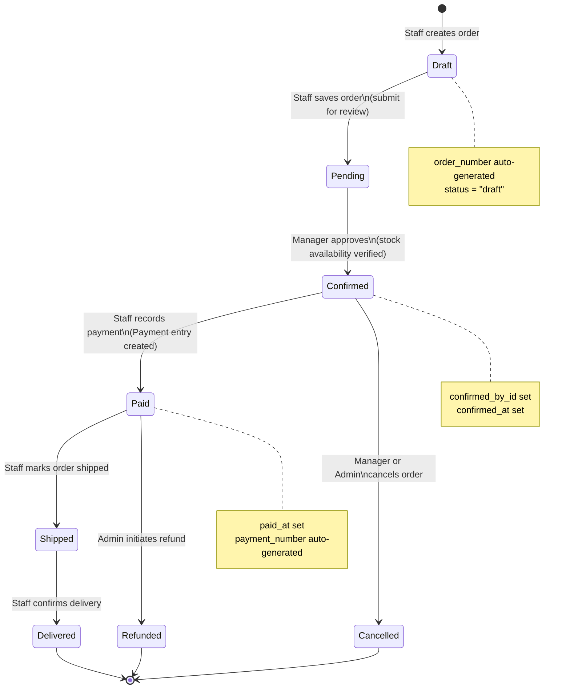
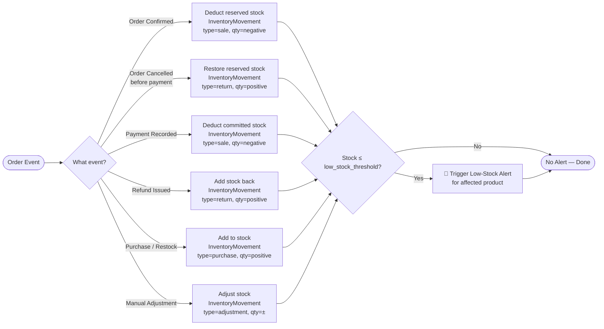
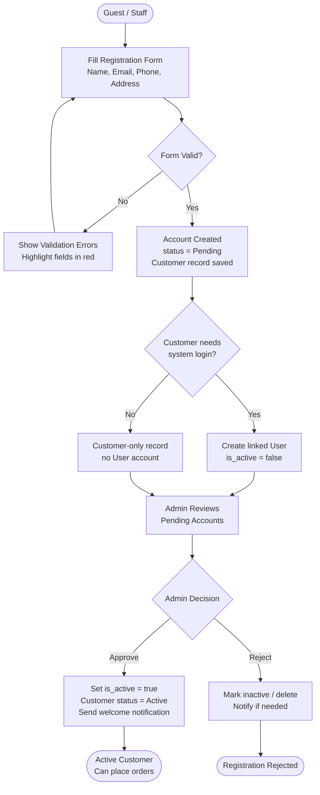
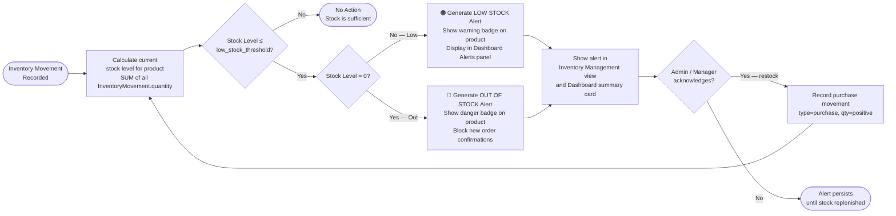

# RetailOps — Workflow Diagrams

---

## Workflow A — Order-to-Payment Lifecycle

---

## Workflow B — Inventory Update Logic

---

## Workflow C — User Onboarding / Customer Registration

---

## Workflow D — Low-Stock Alert

